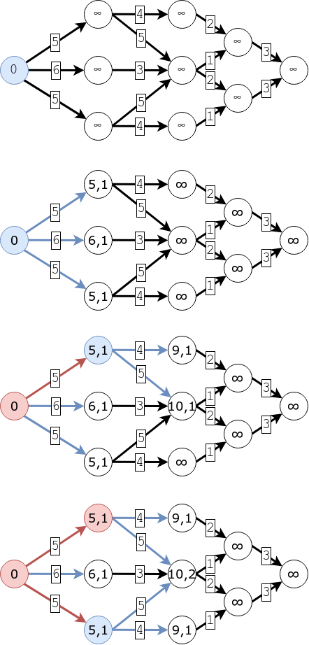
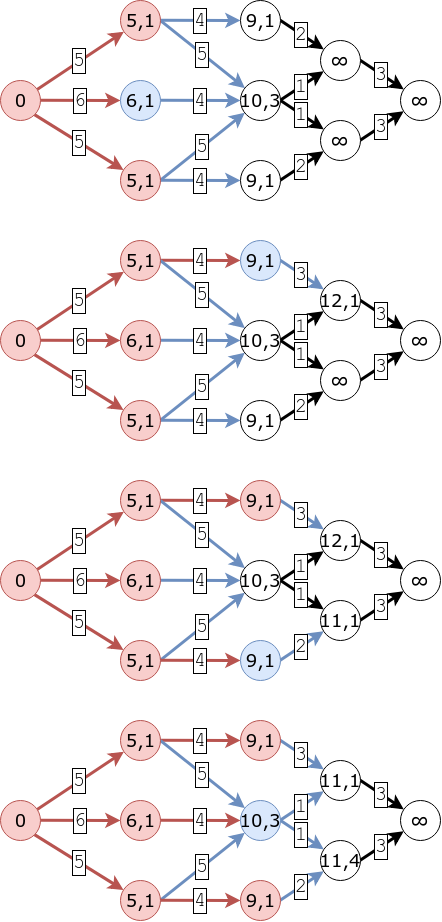
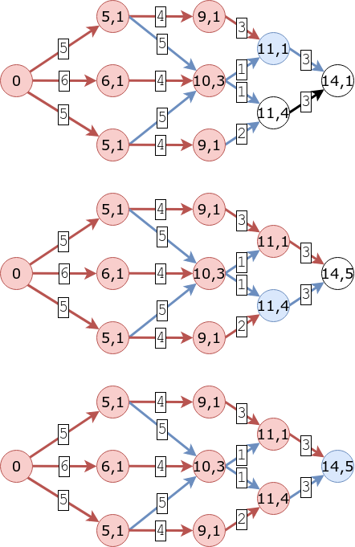

Consigna
========

Ejercicio 1
-----------

a. ¿Qué técnicas algorítmicas vimos en la materia?

b. Explicar alguna de ellas.


    - Golosos: Resuelven un problema dividiéndolo en subproblemas, y tomando una
    decisión en cada paso de forma tal que cada subsolución es óptima.

    - Recursivos: Son aquellos algoritmos que se llaman a sí mismos.

    - Divide & Conquer: Es un caso particular de los algoritmos recursivos, que
    respeta un patrón en donde se divide la instancia actual del problema en k
    subinstancias más pequeñas, se las resuelve recursivamente, y luego se las
    combina para obtener la solución final. Para tamaños de instancias
    suficientemente pequeños (casos base), se utiliza un algoritmo adhoc.

    - Fuerza Bruta: Es resolver el problema analizando todo el espacio posible de
    soluciones. Normalmente esto es muy costoso.

    - Backtracking: Al igual que en una solución por fuerza bruta, se recorre todo
    el espacio de soluciones, que se representa comunmente como un árbol,
    dividiendo el espacio en subsoluciones, en donde cada subsolución surge de
    agregar un elemento a la subsolución padre, y analizando sólamente aquellas
    subsoluciones que sean candidatas (aquellas que, según la función de
    factibilidad puedan llegar a generar una solución válida). También, en los
    problemas de optimización se realizan podas por optimalidad, es decir, si
    existe una solución mejor, y toda solución que dependa de una subsolución va
    a ser peor que esta, entonces se descarta el análisis de toda la rama.

    - Dinámicos: El problema se divide en subproblemas de tamaño menor, que son
    más fáciles de resolver. Existen dos versiones, top-down recursivo (usando
    memoización) y bottom-up iterativo. Se utiliza la idea de que existe un
    solapamiento de subproblemas en el árbol de soluciones, y se van guardando
    los resultados para no calcularlos más de una vez. En el caso de los
    algoritmos de optimización, deben cumplir el Principio de Optimalidad de
    Bellman, que dice que si una solución es óptima para un problema dado,
    entonces cada subsolución que debe ser óptima para el subproblema
    correspondiente.

    - Heurísticas: Es un algoritmo que intenta obtener soluciones para el problema
    que debe resolver, pero no necesariamente lo hace en todos los casos.

Ejercicio 2
-----------

a. Explique cómo modificar el algoritmo de Dijkstra para contar el número de
caminos mínimos de `v` a `w`.

    Dijkstra va guardando, para cada nodo, el largo del camino mínimo de v hasta
    ese nodo. Si además de esto guardamos la cantidad de caminos que tienen ese
    largo, luego en particular es posible saber la cantidad de caminos mínimos
    de v a w. Para ir guardando la cantidad de caminos que tienen un determinado
    largo, alcanza con guardar para cada nodo u un contador que cada vez que
    encontramos un camino desde el nodo x cuyo largo sea igual al que ese nodo
    ya tenía marcado como mínimo, entonces le suma la cantidad de caminos que
    tenía x. Y se setea (en 1) cada vez que encontramos un camino menor.








```
DIJKSTRA (Graph, source_node s):
for u ∈ V[G]:
    dist[u] = ∞
    count[u] = 0
    parent[u] = NULL
dist[s] = 0
count[s] = 1
queue.add(s,dist[s])

while not queue.empty():
    u = queue.get_min()
    for v ∈ Adj[u]
        if dist[v] == dist[u] + w(u,v)
            count[v] += count[u]
        if dist[v] > dist[u] + w(u, v):
            dist[v] = dist[u] + w(u, v)
            count[v] = 1
            parent[v] = u
            queue.add(v,dist[v])
```

b. Explique coḿo modificar el algoritmo de Dijkstra de modo tal que si hay más
de un camino mínimo de `v` a `w`, se elija el camino con el menor número de
aristas.

    En vez de guardar sólamente el largo del camino, para cada nodo guardo la
    tupla (largo, cantidad_de_aristas), y la utilizo en la comparación. Esto va
    a hacer que los caminos cuyo largo sea el mismo desempaten por cantidad de
    aristas.

Ejercicio 3
-----------

Dado un grafo `G = (V,X)` con una función de costo definida sobre sus aristas,
`l: X->R`. Probar que si existe un `e ∈ X` tal que `l(e) < l(e')` para todo `e'
∈ X`, entonces `e` pertenece a todo árbol generador mínimo de `G`.

    Sea T un AGM de G tal que e∉T. Por definición de árbol, el grafo resultante
    de agregar e a T tiene exactamente un ciclo, y este pasa por e. Sea e'∈T una
    arista del ciclo que contiene a e. Quiero ver que T' = (T+e)−e' es un árbol.
    Dado que T es conexo, T+e es conexo, y dado que e' pertenece a un ciclo,
    (T+e)−e' es conexo. Además, dado que T tiene n-1 aristas, T+e tiene n
    aristas, y (T+e)−e' tiene n-1 aristas. Al ser conexo y con n-1 aristas, es
    un árbol. Dado que es un árbol, y que G tiene n nodos, en particular es un
    árbol generador. Sea l(T) = ∑(x∈T) l(x) el costo total del árbol T y l(T') =
    ∑(x∈T') l(x) = ∑(x∈(T+e)−e') l(x) = ∑(x∈T) l(x) + l(e) - l(e') el costo
    total de T'. Luego, l(T') = l(T) + l(e) - l(e') y dado que l(e) < l(e'),
    l(T') < l(T), lo cual es absurdo porque T es AGM, y surge de suponer que
    existe algún AGM tal que e no pertenezca al mismo.

Ejercicio 4
-----------

Un grafo `G` es coloreable en forma única si todo coloreo con `χ(G)` colores
induce la misma partición de los vértices. Mostrar que si `G` es coloreable en
forma única el subgrafo inducido por dos conjuntos cualesquiera de la partición
inducida por los `χ(G)-coloreos` es un subgrafo conexo.

    Sea un grafo G coloreable en forma única tal que todo coloreo con χ(G)
    colores induce la partición {V₁, ⋯, Vₖ} con k=χ(G). Supongo que no vale la
    propiedad. Luego existen dos conjuntos X,Y ∈ {V₁, ⋯, Vₖ} tales que X≠Y y el
    subgrafo inducido por X e Y no es conexo. Formo el conjunto de nodos Z=X∪Y y
    los pinto a todos del mismo color. No existe ninguna arista entre dos nodos
    cualesquiera de Z. Luego, formo una nueva partición sacando X e Y de la
    partición anterior, y agregando Z. La nueva partición representa un
    "χ(G)−1"-coloreo, lo cual es absurdo, y surge de suponer que la propiedad no
    vale.

Ejercicio 5
-----------

a. Si todos los arcos de una red tienen diferentes capacidades, la red tiene un
único corte mínimo.

b. Si se multiplican las capacidades de todos los arcos por `λ > 0`, el o los
cortes mínimos no cambian.

c. Si se multiplican las capacidades de todos los arcos por `λ > 0`, el valor
del o de los cortes mínimos no cambia.

d. Si se suma a las capacidades de todos los arcos `λ > 0`, el o los cortes
mínimos no cambian.

e. Si se suma a las capacidades de todos los arcos de `λ > 0`, el valor del o de
los cortes mínimos no cambia.

Ejercicio 6
-----------

a. ¿Cuándo un problema pertenece a la clase P?

b. ¿Cuándo un problema pertenece a la clase NP?

c. ¿Cuándo un problema pertenece a la clase NP - C?

d. ¿Qué es una reducción polinomial de un problema de decisioń Π1 a uno Π2?

e. Demostrar que el problema de conjunto independiente máximo (versión decisioń)
pertenece a la clase NP.

f. En la práctica, ¿cómo se demuestra que un problema pertenece a la clase NP -
C? Justificar.

g. Enunciar 5 problemas estudiados en la materia que sean P y 5 que sean NP-C.

Resolución
==========

Ejericio 3
----------

* Sea `e ∈ X` tal que `l(e) < l(e')` para todo `e' ∈ X`. Quiero ver que `e`
pertenece a todo AGM de `G`.

* Supongo que existe `T=(V,XT)` un AGM de `G` tal que `e=(u,v)` no pertenece a
`T`. Sea `kT = l(T) = l(XT)` el resultado de sumar el costo de todas las aristas
del AGM `T`.

* Sean `u` y `v` los nodos sobre los que incide `e`. Dado que `T` es un AGM,
existe un único camino `P = (u ... v)` de `u` a `v` en `T` formado por aristas
`p1, ..., pk` de `XT`, todas distintas de `e`. Sea `kP`el costo de sumar todas
las aristas que pertenecen a `P`, y `kNP'` el costo de sumar todas las aristas
que pertenecen a `XT` pero no pertenecen a `P`, dado que `XT = P U (XT\P)` vale
que `kT = kP + kNP`.

* Sea `C = P U {e}` el circuito simple resultante de agregar la arista `e` a `P`.
El costo del circuito `C` es `kC = l(C) = l(P) + l(e) = k+e`.

* Sea `P2=C\p` el camino resultante de sacarle `pi` (cualquier arista de `P`) a
`C`. Vale que `P2` es conexo, y su costo es `kP2 = kC - l(pi) = l(P) + l(e) -
l(pi)`. `kP2 < kP` sí y sólo sí `l(e) < l(pi)`. Y `l(e) < l(pi)` vale por
enunciado.

* Sea `XT2 = XT - {pi} U e = P2 U (XT\P)` el conjunto resultante de sacarle la 
arista `pi` y agregarle `e` a `XT`, y sea `T2=(V,XT2)` el grafo correspondiente.
    * Vale que `l(T2)<l(T)`, ya que `kT2 = kP2 + kNP < kT = kP + kNP`, 
    puesto que `kP2 < kP`.
    * Vale que `T2` es conexo.

* Dado que `XT2` es conexo y tiene `n-1` aristas, es un árbol. En particular, es
un arbol de menor costo al AGM. Absurdo surgido de suponer que existe un `T` tal
que `e` no pertenece a ese `T`.

* Finalmente, `e` pertenece a todo AGM de `G`.