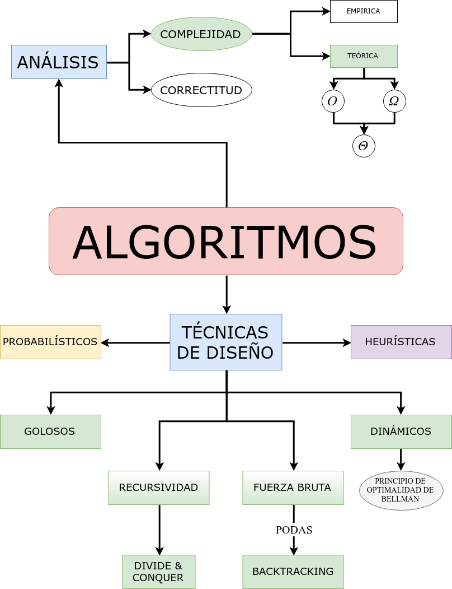

Algoritmos
==========

¿Qué es un algoritmo?
---------------------
    Es un conjunto de reglas para resolver un determinado problema.

Deben cumplir las siguientes características:
* precisos: todos los pasos están claramente especificados
* bien definidos: resuelve el problema dado, y para toda ejecución produce el mismo resultado
* finitos: termina

Complejidad
===========

Análisis de algoritmos
----------------------

* Empírico: implementarlos, correrlos y medirlos. Tiene desventajas
    * pérdida de tiempo del programador
    * pérdida de tiempo de cómputo
    * conjunto de instancias acotado

* Teórico: determinar matemáticamente la cantidad de tiempo que va a llevar su ejecución. Requiere definir
    * modelo de cómputo
    * lenguaje sobre este modelo
    * instancias relevantes
    * tamaño de la instancias

Modelo de Cómputo: Máquinas RAM
-------------------------------
* Máquina de registros + Acumulador + Direccionamiento Indirecto
* Permite modelar computadoras en donde la memoria es suficiente y donde los enteros entran en una palabra.
    * Unidad de entrada: Sucesión de celdas numeradas, cada una con un entero de tamaño arbitrario.
    * Unidad de salida: Sucesión de celdas.
    * Memoria: Sucesión de celdas numeradas, cada una puede almacenar un entero de tamaño arbitrario.
    * Programa no almacenado en memoria.
* Un programa es una secuencia de instrucciones que son ejecutadas secuencialmente comenzando por la primera instrucción.
* Hay un contador de programa, que identifica la próxima instrucción a ser ejecutada.
* Hay tanta memoria como se necesite.
* Se puede acceder de forma directa a cualquier celda (acceso aleatorio).
* Los enteros entran en una celda de memoria.
* Hay un registro especial llamado acumulador en donde se realizan los cálculos.

### Operaciones Básicas
* Modelo uniforme: cada operación básica tiene un tiempo de ejecución constante.

* Modelo logarítmico: el tiempo de ejecución de cada operación es una función del tamaño de los operandos.

### Tamaño de una instancia
    Dada una instancia I, se define |I| como el número de símbolos de un alfabeto finito necesarios para codificar I.

* Depende del alfabeto y de la base.
    * Para almacenar un `n:ℕ` se necesitan `L(n) = ⎣log₂(n)⎦ + 1` dígitos binarios.
    * Para almacenar una lista de `m` enteros, se necesitan `L(m) + m*L(N)` dígitos binarios, en donde `N` es el valor máximo de la lista.

* Depende del problema que se esté analizando.

* En general, para problemas de ordenamiento, problemas sobre grafos, etcétera, utilizaremos como tamaño de la entrada la cantidad de elementos de la instancia de entrada.

* Para problemas sobre números (como cálculo del factorial) es más apropiado utilizar como tamaño de entrada la cantidad de bits necesarios para representar la entrada en binario.

Notación O
----------

Dadas dos funciones f,g: N -> R, decimos que:

* `f(n)=O(g(n))` si existen `c:R⁺` y `n₀:ℕ` tales que `f(n)≤c*g(n)` para todo `n≥n₀`.
* `f(n)=Ω(g(n))` si existen `c:R⁺` y `n₀:ℕ` tales que `f(n)≥c*g(n)` para todo `n≥n₀`.
* `f(n)=Θ(g(n))` si `f=O(g(n))` y `f=Ω(g(n))`.

Problema bien resuelto
----------------------
    Un problema está bien resuelto si existe un algoritmo de complejidad polinomial para el problema.

Técnicas de diseño de algoritmos
================================

Algoritmos Golosos
------------------
* Problema de optimización.
* Se cuenta con una lista de candidatos.
* En cada iteración, se van eligiendo algunos candidatos, y descartando otros.
* Composición típica de un algoritmo goloso:
    * Hay una función que **verifica** cuando un conjunto de candidatos es **solución al problema** (sin tener en cuenta cuestiones de optimalidad).
    * Hay otra **función de factibilidad** que verifica si un conjunto de candidatos es factible, es decir, si sirve para (agregando más candidatos) armar una posible solución al problema.
    * **Función de selección**: indica en cada paso cuál de los candidatos pendientes es el siguiente a elegir.
    * **Función objetivo**: indica el "valor" de una solución representada por un conjunto de candidatos. Es este valor el que se busca optimizar (minimizar, maximizar).

Recursividad
------------
Es cuando para resolver un problema, se llama a instancias "más simples" del mismo problema. Se requiere contar con al menos un caso base.

Ejemplo:
* Problema(L) = Problema(L-1) + 1
* Problema(1) = 1

* Problema(5) = Problema(4)+1 = Problema(3)+1+1 = Problmea(2)1+1+1 = Problema(1)+1+1+1+1 = 1+1+1+1+1 = 5.

Divide and Conquer
------------------
* Caso base: Si la instancia de entrada es pequeña, utilizar un algoritmo ad-hoc para el problema.

* Caso recursivo sobre instancia L:
    * Dividir L en subinstancias más pequeñas: L₁, L₂, ... Lₖ.
    * Resolver recursivamente las k subinstancias.
    * Combinar las soluciones de las k subinstancias, para obtener una solución para L.

* Ejemplo: `Solucion(L)=Combinar(Solucion(L₁),Solucion(L₂))`, con `L=L₁+L₂`

### CLRS
    2.3.1 The Divide-and-conquer approach
    Many useful algorithms are recursive in structure: to solve a given problem, they call themselves recursively one or more times to deal with closely related subproblems. These algorithms typically follow a divide-and-conquer approach: they break the problem into several subproblems that are similar to the original problem but smaller in size, solve the subproblems recursively, and then combine these solutions to create a solution to the original problem.
    The divide-and-conquer paradigm involves three steps at each level of the recursion:

    - Divide the problem into a number of subproblems that are smaller instances of the same problem.
    - Conquer the subproblems by solving them recursively. If the subproblems sizes are small enough, however, just solve the subproblems in a straightforward manner.
    - Combine the solutions to the subproblems into the solution for the original problem.

#### Ejemplos

- Búsqueda Binaria _(¡Depende cómo se lo mire!)_
- Mergesort
- Quicksort
- Median of Medians
- Multiplicación de matrices Strassen
- Máximo subarreglo

Backtracking
------------
* Recorrer todas las posibles configuraciones del espacio de soluciones.

* Normalmente se usa un vector `a = (a₁, a₂, ..., aₙ)` para representar una solución candidata, con cada `aᵢ` perteneciente a un conjunto finito `Aᵢ` (dominio).

* El espacio de soluciones es el producto cartesiano `A₁ x ... x Aₙ`.

* En cada paso se extienden las soluciones parciales `a = (a₁, ..., aₖ)` con `k < n`.
    * Se extiende agregando al final del vector `a` un elemento `aₖ+₁ ∈ Sₖ+₁ ⊆ Aₖ+₁`.
    * Estas soluciones parciales son sucesoras de la anterior.

* **PODA**: Si `Sₖ+₁` es vacío (o sea, ya no hay soluciones sucesoras posibles), esa rama no se continúa explorando.
    * Factibilidad: ninguna extensión de la solución parcial derivará en una solución del problema.
    * Optimalidad: ninguna extensiónd e la solución parcial derivará en una solución óptima del problema (ej: "existe una solución mejor").

Programación Dinámica
---------------------
### Idea:
* Es aplicada a problemas de optimización.
* El problema es dividido en subproblemas de tamaño menor. Una vez resueltos estos subproblemas, se combinan para generar una solución al problema original.
* Es **bottom up**, y no es recursivo.
* Se guardan la soluciones de los subproblemas para no calcularlos más de una vez.

### Principio de optimalidad de Bellman
    Un problema de optimización satisface el principio de optimalidad de Bellman si en una solución óptima cada subsolución es a su vez óptima del subproblema correspondiente.

* Es decir, cada subsolución de una solución óptima debe ser solución óptima del subproblema asociado a esa subsolución.

* Es condición necesaria para poder usar programación dinámica.

Algoritmos probabilísticos
--------------------------
* Cuando un algoritmo de optimización tiene que hacer una elección, lo hace al azar en vez de gastar mucho tiempo buscando la mejor elección.

* Algoritmos numéricos: dan una respuesta aproximada.
    * Más tiempo proceso => más precisión tengo.
    * Ej: integrales

* Algoritmos de Montecarlo: con alta probabilidad dan una respuesta correcta.
    * Más tiempo proceso => más probabilidad de acertar.
    * Ejemplo: determinar la existencia de un arreglo de un elemento mayor a un valor dado.

* Algoritmos de Las Vegas: si da una respuesta es correcta, pero puede no darla.
    * Más tiempo proceso => más probabilidad de que el algoritmo de una respuesta.
    * Ejemplo: problema de las n reinas.

* Algoritmos Sherwood: randomiza un algoritmo determinístico donde hay una gran diferencia entre el peor caso y el caso promedio. Elimina la diferencia entre las buenas y las malas instancias.
    * Ejemplo: quicksort con pivote random.

Heurísticas
-----------

* Dado un problema `Π`, un algoritmo heurístico es un algoritmo que intenta obtener soluciones de buena calidad para el problema que quiere resolver pero no necesariamente lo hace en todos los casos.

* Sea `Π` un problema de optimización, `I` una instancia del problema, `x⁺(I)` el valor óptimo de la función a optimizar en dicha instancia.
    * Un algoritmo heurístico obtiene una solución con un valor que se espera sea cercano a ese óptimo pero no necesariamente el óptimo.

* Si H es un algoritmo heurístico para un problema de optimización llamamos `xᴴ(I)` al valor que devuelve la heurística.

* `H` es un algoritmo `ε–aproximado` para el problema `Π` si para algún `ε > 0`, `|xᴴ(I) − x⁺(I)| ≤ ε|x⁺(I)|`