Grafos
======
Diagramas
---------

### Tipos de Grafos
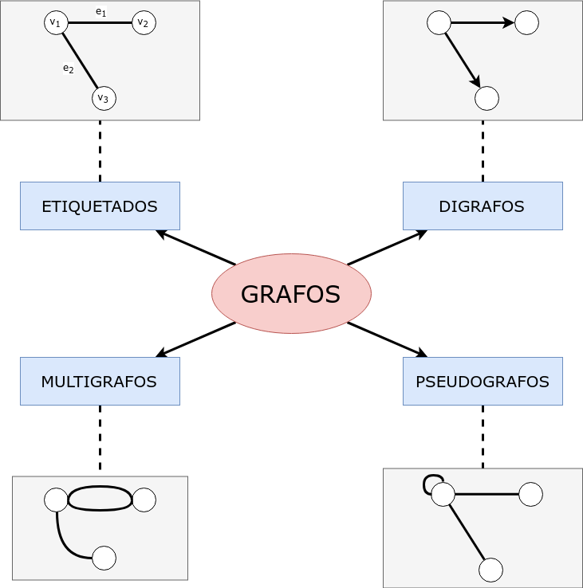

### Grafos Comunes (notación)
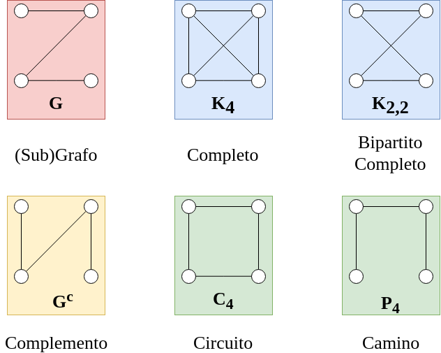

Definiciones
------------
* Un **grafo** `G = (V, E)` o `G = (V, X)` son dos conjuntos:
    * `V` un conjunto de **nodos, vértices o puntos**.
        * `n = |V|`
    * `E` o `X` un conjunto de **aristas, ejes o arcos**.
        * Una arista `e = (u,v)` es un par no ordenado de nodos.
        * `m = |E|`

* Dado `G=(V,E)`, `u,v,w ∈ V`, `e=(u,v),f=(v,w) ∈ E`, entonces
    * al estar unidos por `e`, `u` y `v` son **nodos adyacentes**
    * `e` es **incidente** a `u` y `v`
    * al compartir el nodo `v`, `e` y `f` son **aristas adyacentes**
    ```
    Ejemplo grafo G:

        e       f
    u ----- v ----- w
    ```

* El **grado** de un nodo `v` (`d(v)`), es la cantidad de aristas incidentes a `v`.
    ```
    v1 ---> v2 ---> v4          d(1) = 2
     \                          d(2) = 2
      \                         d(3) = 1
       \                        d(4) = 1
        --> v3
    ```

* Un **grafo orientado o digrafo** `G = (V, X)` es un par de conjuntos `V` y `X` donde `V` es el conjunto de puntos, nodos o vértices y `X` es un subconjunto del conjunto de los pares
ordenados de elementos distintos de V.
    * El **grado de entrada** `din(v)` de un nodo `v` de un grafo
orientado es la cantidad de arcos que llegan a `v`. Es decir, la
cantidad de arcos que tienen a `v` como segundo elemento.
    * El **grado de salida** `dout(v)` de un nodo `v` de un grafo
orientado es la cantidad de arcos que salen de `v`. Es decir, la
cantidad de arcos que tienen a `v` como primer elemento.

    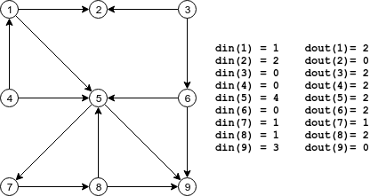

* Un grafo `K` se dice **completo** (`Kₙ`) si todos los nodos son adyacentes entre sí.
    * Obs: un `Kₙ` tiene `∑{i=1⋯n} i = n(n-1)/2` aristas.

    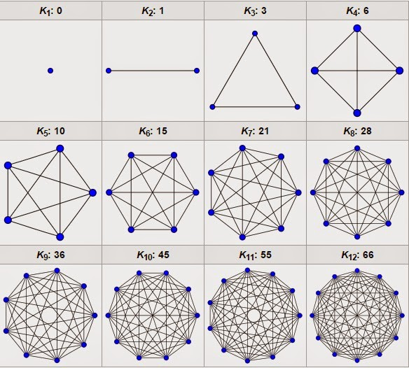

* Dado un grafo `G = (V, E)`, el **grafo complemento** tiene el mismo conjunto de nodos y para cada par de nodos en `Gᶜ` son adyacentes si y solo si no son adyacentes en `G`. Notación: `Gᶜ`, `G^c` o `G^_` es el grafo complemento de `G`.
    * Obs: Si `G` tiene `n` nodos y `m` aristas, `Gᶜ` tiene `n` nodos y `(n-1)n/2 - m` aristas.

    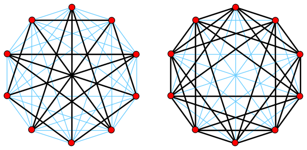

* Dado un grafo `G = (V, X)`, un **subgrafo de G** es un grafo `H = (V', X')` tal que `V' ⊆ V` y `X' ⊆ X ∩ (V' × V')`.
    
    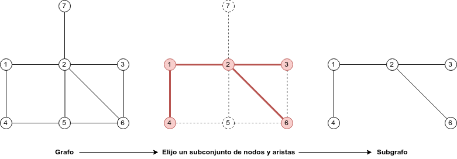

* Un subgrafo `H = (V', X')` de `G = (V, X)`, es un **subgrafo inducido** (por nodos) si para todo par de nodos `u, v ∈ V'`, `(u, v) ∈ X ⇐⇒ (u, v) ∈ X'`.

    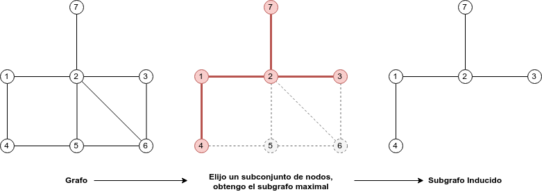

    - Es decir, es el subgrafo `H` maximal tal que `V'⊆V`.

* Dados dos grafos `G = (V, X)` y `G0 = (V', X')` se dicen **isomorfos** si existe una función biyectiva `f : V → V'` tal que para todo `v, w ∈ V`: `(v,w) ∈ X ⇐⇒ (f (v), f (w)) ∈ X'`.

    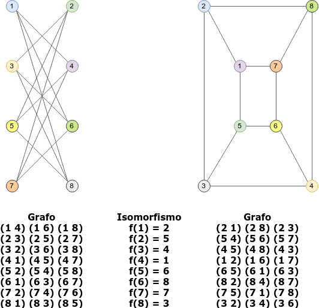

    **Obs:** Si dos grafos `G = (V, X)` y `G' = (V', X')` son isomorfos, entonces:
    * tienen el **mismo número de nodos**,
        * para todo `k`, `0 ≤ k ≤ n − 1`, tienen el mismo número de nodos de grado `k`,
    * tienen el **mismo número de aristas**,
        * para todo `k`, `1 ≤ k ≤ n − 1`, tienen el mismo número de caminos simples de longitud `k`.
    * tienen el **mismo número de componentes conexas**,

Tipos de Grafos
---------------
* Un **grafo etiquetado** es en donde a las aristas, o a los vértices, o a ambos, se les asignan etiquetas, generalmente mediante números enteros.

    ```
    Ejemplo de grafo etiquetado: 
    G=({v1,v2,v3,v4},{e1=(v1,v2),e2=(v2,v4),e3=(v3,v2),e4=(v4,v3)})

           e1          e2
    v1 --------- v2 -------- v4
                   \        /
                 e3 \      / e4
                     \    /
                       v3

    ```

* Un **multigrafo** es un grafo en el que pueden haber varias aristas entre sí.

    ```
    Ejemplo de multigrafo: 
    e1=(v1, v2), e2=(v2, v3), e3=(v1, v2)
         
         e1          e2
    v1 ------- v2 ------- v3
      \       /
       \-----/
         e3

    Notar que, si bien conectan los mismos nodos, e1≠e3
    ```

* Un **seudografo** es un grafo en el que pueden haber loops que unan a un nodo con sí mismo.

    ```
    Ejemplo de seudografo: 
    e1=(v1, v2), e2=(v2, v3), e3=(v3,v3)
         
         e1          e2     /--\
    v1 ------- v2 ------- v3    | e3
                            \--/
    ```

* Un **digrafo** o **grafo dirigido** es aquel en donde las aristas son pares ordenados de nodos. Dicho de otro modo, las aristas tienen dirección.

    ```
         e1         e2
    v1 ------> v2 ------> v3
     \         |         /
      \        / e4     /
    e5 \      |        / e3
        \     V       /
         --> v4 <-----

    ```


Caminos
-------
* Un **camino** en un grafo es una sucesión de aristas `e₁ e₂ ... eₖ` tal que un extremo de ei coincide con uno de `eᵢ−₁` y el otro con uno de `eᵢ+₁` para `i=2,...,k-1`.

    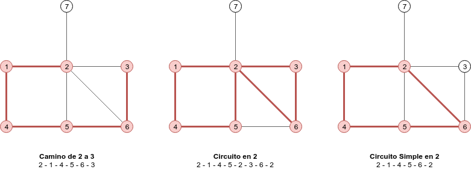

    * Un **camino simple** es un camino que no pasa dos veces por el mismo nodo.
    * Un **circuito** es un camino no trivial cerrado (ie. _que empieza y termina en el mismo nodo_).
    * Un **circuito simple** es un circuito de 3 o más nodos que no pasa dos veces por el mismo nodo.
    * Un **grafo acícliclo** es aquel que no tiene circuitos.

    * Obs: Un circuito es, o bien un circuito simple, o bien una unión disjunta de circuitos simples.

* Un **camino orientado** en un grafo orientado es una sucesión de arcos `e₁ e₂ ... eₖ` tal que el primer elemento del par `eᵢ` coincide con el segundo de `eᵢ−₁` y el segundo elemento de `eᵢ` con el primero de `eᵢ+₁`, para `i = 2,..., k − 1`.

    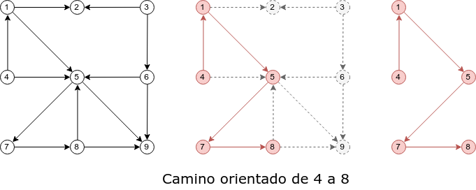

    * Un **circuito orientado** en un grafo orientado es un camino orientado que comienza y termina en el mismo nodo.
        
        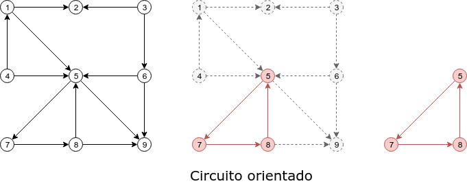

* La **longitud de un camino** es la cantidad de aristas que tiene ese camino.

* Un **camino mínimo** (o geodésico) entre dos nodos es aquel cuya longitud es menor o igual a cualquier otro camino entre esos nodos.

* La **distancia entre dos nodos** `v` y `w` (`d(v,w)`) se define como la longitud del camino mínimo de `v` a `w`.
    * Para todo nodo `v`, `d(v,v) = 0`.
    * Si no existe camino entre `v` y `w`, se dice que `d(v,w) = ∞` (distancia infinita).

* La función de distancia cumple las siguientes propiedades para todo `u`, `v`, `w` pertenecientes a `V`:
    * `d(u, v)` = `0` si y sólo si `u = v`.
    * `d(u, v)` = `d(v, u)`.
    * `d(u, w)` ≤ `d(u, v) + d(v, w)`.

* La **concatenación** de dos caminos `P₁ = (v₁ v₂) ⋯ (vₖ₋₁ vₖ), P₂ = (vₖ vₖ₊₁) ⋯ (vₙ₋₁ vₙ)`, es un nuevo camino `P₃= P₁ + P₂` tal que `P₃ = (v₁ v₂) ⋯ (vₖ₋₁ vₖ) (vₖ vₖ₊₁) ⋯ (vₙ₋₁ vₙ)`.

* Dado un camino `P = [e₁ ⋯ eₙ]` de largo `n`, un **subcamino** `Pᵢ,ⱼ = P[i:j] = [eᵢ ⋯ eⱼ]` con `0≥i≥j≥n` es una subsecuencia de largo `j-i` tal que la arista `k` de `P[i:j]` se corresponde con la arista `k+i` de `P`.

* El **diámetro de un grafo** es la longitud del máximo camino mínimo entre todo par de nodos.

Bipartitos
----------
* Un grafo `G = (V, X)` se dice **bipartito** si existe una partición `V₁`, `V₂` del conjunto de nodos `V` tal que:
    * `V = V₁ ∪ V₂`
    * `V₁ ∩ V₂ = ∅`
    * `V₁ != ∅` 
    * `V₂ != ∅`
    * Todas las aristas de `G` tienen un extremo en `V₁` y otro en `V₂`.

    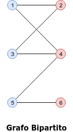

* Un grafo bipartito con partición `V₁, V₂`, es **biparito completo** si todo nodo en `V₁` es adyacente a todo nodo en `V₂`.
    - Un bipartito completo con `|V₁|=a` y `|V₂|=e` se denota `Kₐ,ₑ`

    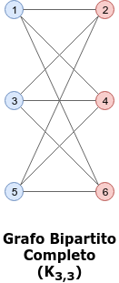

Operaciones
-----------
* Dado un grafo `G=(V,X)`, el resultado de **remover una arista** `e∈X` es un grafo `G−e = G' = (V, X')` tal que `X' = X \ e`.

* Dado un grafo `G=(V,X)`, el resultado de **remover un nodo** `v∈V` es un grafo `G−v = G' = (V',X')` tal que `V' = V \ v` y `X'⊆X` tal que `∀e∈X`, si `e` no es incidente en `v`, entonces `e∈X'`.
    - Es decir, `G'` es el subgrafo que surge de remover el nodo y todas las aristas adyacentes al mismo.
    - O, lo que es lo mismo, `G'` es el subgrafo inducido por nodos tal que `V' = V \ v`.

* La **unión de dos grafos** `G₁=(V₁, X₁), G₂=(V₂, X₂)`, denotada `G₁ ∪ G₂`, consiste en armar un `G = (V, X)` tal que `V = V₁ ∪ V₂` y `X = X₁ ∪ X₂`.

    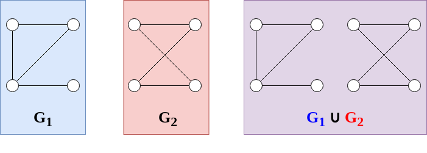

* La **suma de dos grafos** `G₁=(V₁, X₁), G₂=(V₂, X₂)`, denotada `G₁ + G₂`, consiste en armar un `G = (V, X)` tal que `V = V₁ ∪ V₂` y `X = X₁ ∪ X₂ ∪ X₁₂`, en donde `X₁₂` son todas las aristas que van desde `V₁` hasta `V₂`.

    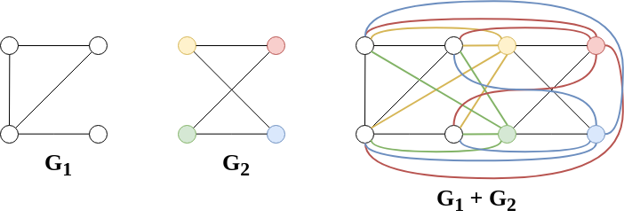

    - El grafo bipartito `Kₘₙ = Kₘᶜ ∪ Kₙᶜ` es la unión de los complementos de los completos `Kₘ` y `Kₙ`.

        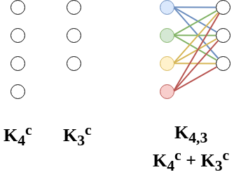

* El **producto de dos grafos** `G₁=(V₁, X₁), G₂=(V₂, X₂)`, denotado `G₁ × G₂`, consiste en armar un `G = (V, X)` tal que `V = V₁ × V₂` y dados `u=(u₁, u₂)` y `v=(v₁, v₂)` en `V`, vale que `(u,v) ∈ X ⟺ [u₁=v₁ ∧ (u₂,v₂)∈X₂] ∨ [u₂=v₂ ∧ (u₁,v₁)∈X₁]`.

* La **composición de dos grafos** `G₁=(V₁, X₁), G₂=(V₂, X₂)`, denotada `G₁[G₂]`, consiste en armar un `G = (V, X)` tal que `V = V₁ × V₂` y dados `u=(u₁, u₂)` y `v=(v₁, v₂)` en `V`, vale que `(u,v) ∈ X ⟺ [u₁=v₁] ∨ [u₂=v₂ ∧ (u₁,v₁)∈X₁]`.

### Comparación de Operaciones

| Operación     | Número de nodos   | Número de aristas |
| :-----------: | :---------------: | :---------------: |
| Unión         | n₁ + n₂           | m₁ + m₂           |
| Suma          | n₁ + n₂           | m₁ + m₂ + n₁⋅n₂   |
| Producto      | n₁⋅n₂             | n₁⋅m₂ + n₂⋅m₁     |
| Composición   | n₁⋅n₂             | n₁⋅m₂ + (n₂)²⋅m₁  |

Conectividad
------------
* Dado `G=(V,X)`, `u,v∈V`, `v` **es alcanzable desde** `u` si existe un camino desde `u` hasta `v`.

* Un grafo se dice **conexo** si existe un camino entre todo par de nodos, es decir, si todos los nodos son alcanzables entre sí.

* Un digrafo se dice **débilmente conexo** (o simplemente **conexo**) si el grafo no dirigido subyacente es **conexo**.

* Un digrafo se dice **fuertemente conexo** si para todo par de nodos `u, v` existe un camino orientado de `u` a `v` y otro de `v` a `u`.

    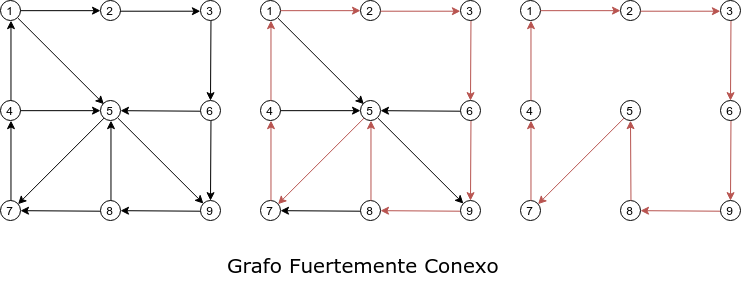

* Una **componente conexa** de un grafo `G` es un subgrafo conexo maximal de `G`.

    

* Dado un grafo `G=(V,X)`, un **nodo de corte** `v∈V` es aquel tal que al removerlo la cantidad de componentes conexas del grafo aumenta.

* **Teorema**: Sea `v` un nodo de `G=(V,X)` conexo, son equivalentes:
    - `v` es un nodo de corte de `G`.
    - Existen puntos `u,w ∈ V, u≠v, w≠v` tales que `v` está en cada camino de `u` a `w`.
    - Existe una partición `U,W ⊆ V−{v}` del conjunto de nodos en subconjuntos tales que `∀u∈U ∀w∈W`, `v` está en todo camino de `u` a `w`.

* Dado un grafo `G=(V,X)`, una **arista puente** `e∈X` es aquella tal que al removerla la cantidad de componentes conexas del grafo aumenta.

* **Teorema**: Sea `e` una arista de `G=(V,X)` conexo, son equivalentes:
    - `e` es un puente de `G`.
    - `e` no está en ningún ciclo de `G`.
    - Existen puntos `u,v ∈ V` tales que la arista `e` está en cada camino de `u` a `v`.
    - Existe una partición `U,W ⊆ V` tal que `∀u∈U ∀w∈W`, la arista `e` se encuentra en todo camino desde `u` hasta `w`.

* Dado un grafo `G=(V,X)`, una **arista de ciclo** `e∈X` es aquella tal que forma parte de al menos un ciclo del grafo.

* **Proposición**: Una arista es puente si y sólo sí no es arista de ciclo.

* **Proposición**: Dado un grafo `G=(V,X)`, `e∈X`, sea `c` la cantidad de componentes conexas de `G`, la cantidad de componentes conexas de `G−e` es `c` si `e` es una arista de ciclo, y `c+1` en cualquier otro caso.

* Dado un grafo `G=(V,X)`, un **bloque** es un subgrafo `F⊆G` maximal: conexo, no trivial, y sin nodos de corte.

Representación
--------------
* **Matriz de adyacencia**: `A ∈ R^{n×n}`, donde los elementos `aᵢⱼ` de `A` se definen como `1` si `G` tiene una aristas entre los nodos `i` y `j`, o `0` si no.

    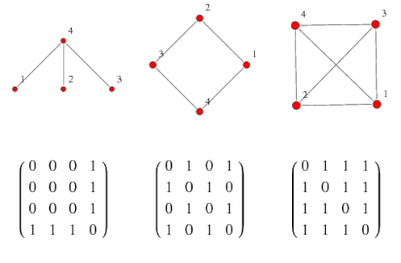

* **Matriz de incidencia**: `B ∈ R^{m×n}`, donde los elementos `bᵢⱼ` de `B` se definen como `1` si la arista `i` es incidente al nodo `j`, o `0` si no.
    
    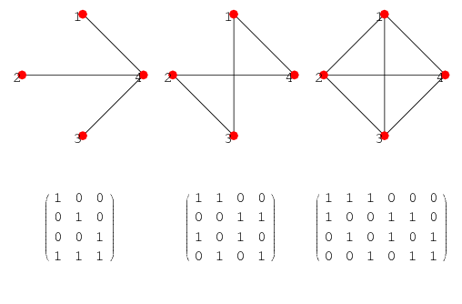

Teoremas sobre Grafos
=====================

### Grado
* La suma de los grados de los nodos de un grafo es igual a 2 veces el número de aristas.
    Sea `G=(V,X)` un grafo. Quiero probar que `∑{v∈V} d(v) = 2m`.

    **Demostración 1)** por definición, el grado de un nodo es la cantidad de aristas que inciden en el mismo. Cada arista incide en dos nodos, está sumando 1 a dos de los nodos de la sumatoria; está sumando 2 al total. Luego, la sumatoria de los grados de todos los nodos es igual al doble de la cantidad de aristas.

    **Demostración 2)** inducción sobre la cantidad de aristas.
    
    P(m): sum(v∈V) d(v) = 2m para todo m natural.
    
    Caso base: P(1): sum(v∈V) d(v) = 2

    ```
      Grafo:
                e1
            v1 ---- v2
    ```
    
    luego d(v1) + d(v2) = 2

    Supongo que vale P(m): sum(v∈V) d(v) = 2m, qvq vale P(m+1): sum(v∈V) d(v) = 2(m+1).

    Sea G' = (V,X') tal que |X'|=m+1.

    Sea G = (V,X), tal que X = X'\e con e=(v1,v2)∈X', y |X| = m.

    Aplicando HI, se obtiene que sum(v∈V) d(v) = 2m en G.

    Dado que e no pertenece a X, en particular v1 y v2 no son adyacentes en G, por lo que cada uno suma 1 a su grado en la sumatoria. Luego, sum(v∈V) d(v) = 2m + 2 en G'.

### Grafo Completo (Kₙ)
* Un `Kₙ=(V,E)` tiene `∑{i=1 ⋯ n-1} i = (n-1)n/2` aristas.
    
    **Demostración 1)** Sea `Kₙ=(V,E)`, aplico la propiedad `∑{v∈V} d(v) = 2m`. Como el grafo es completo, vale `d(v)=n-1 ∀ v∈V`, luego `∑{v∈V} d(v) = n(n-1) = 2m`. Finalmente, `m = n(n-1)/2`.

    **Demostración 2)** Inducción en n.
    * Caso base: `n=1`, vale.
    * Paso inductivo: `n=>n+1`, sea `Kₙ`, asumo que vale la HI para `n`, es decir que `m = n(n-1)/2`. Agrego un nodo, con una arista desde cada otro nodo para formar un `Kₙ₊₁`. En total estoy agregando `n` aristas, por lo que `m = n(n-1)/2 + n = (n(n-1) + 2n)/2 = (n(n-1+2))/2 = n(n+1)/2`. Luego, la propiedad vale para `n+1`.

### Grafo Complemento (Gᶜ)
* Si `G` tiene `n` nodos y `m` aristas, `Gᶜ` tiene `n` nodos y `(n-1)n/2 - m` aristas.
    
    **Demostración** 
    * Dado `G=(V,X)` un grafo de `n` nodos. Sea `Kₙ=(V,XK)` el grafo completo de `n` nodos.
    * Definimos `Xᶜ = XK \ X` el conjunto de aristas tal que `e∈Xᶜ ⟺ e∈XK ∧ e∉X`.
        * Luego el grafo complemento es `Gᶜ=(V,Xᶜ)`.
    * Sea `mᶜ = |Xᶜ| = |XK \ X|`.
        * Dado que `X∈XK`, vale que `mᶜ = |XK|-|X| = |XK| - m`.
        * Sea `|XK|=(n-1)n/2` por ser un grafo completo.
        * Luego `mᶜ = (n-1)n/2 - m`.

### Circuito
* Un circuito es, o bien un circuito simple, o bien una concatenación de circuitos simples.
    
    **Demostración**: Sea `C = (v₁ v₂) ⋯ (vₖ v₁)` un circuito que comienza y termina en el nodo `v₁`. `C` puede ser simple, o no. 
    * En el caso en que `C` es un circuito simple, la propiedad vale trivialmente. 
    * Supongo que el circuito no es simple, quiero ver que entonces es una concatenación de circuitos simples. 
        * Dado que `C` no es simple, pasa más de una vez por `v₁`, es decir que `v₁` aparece al menos una vez en el trayecto de `C`. 
        * En particular, existe `C₁ = (v₁ v₂) ⋯ (vⱼ v₁)` un circuito simple tal que `C₁⊆C`, surgido de recorrer `C` hasta la primera aparición de `v₁`. 
        * Sea `C₂ = (v₁ vⱼ₊₁) ⋯ (vₖ v₁)` el circuito surgido de sacarle a `C` todas las aristas de `C₁`, tal que `C = C₁ + C₂ = (v₁ v₂) ⋯ (vⱼ v₁) + (v₁ vⱼ₊₁) ⋯ (vₖ v₁)`.
        * Restaría ver que `C₂` es, o bien un circuito simple, o bien una concatenación de circuitos simples. Para ello, se puede aplicar la misma lógica:
            * o bien `C₂` es un circuito simple,
            * o bien `C₂` se puede desarmar en `C₃ + C₄`, en donde `C₃` es un circuito simple.
    * Dado que el procedimiento anterior termina resultando en una reducción a casos más simples, y que la longitud de `C` es finita, se puede demostrar aplicando inducción en el tamaño del circuito.

### Distancia
* Si un camino P entre v y w tiene longitud d(v,w), P debe ser un camino simple.

    Sea `G(V,X)` un grafo, sean `v,w ∈ V`, sea `(v u1 ... uk-1 w)` algún camino mínimo de `v` a `w`, de largo `d(v,w)=k`. Sea `P` un camino entre `v` y `w` de longitud `k` (es decir, es un camino mínimo), quiero ver que `P` es un camino simple.

    Supongo que `P` no es un camino simple, luego existe en el recorrido de `P` un circuito simple `C ⊆ P`, con `|C|>=1`, que en particular comienza y termina en un nodo `ux`, de forma tal que `P = P1 U C U P2`, en donde `P1` es un camino que comienza en `v` y termina en `ux`, y `P2` es un camino que comienza en `ux` y termina en `w`.

    Sea `P' = P\C` el resultado de sacar las aristas de `C` en `P`. Luego, `P'` = `P1 U P2 = (v ... ux ... w)` es un camino de `v` a `w` de largo `|P'| = |P1| + |P2| < |P| = k`, es decir, un camino menor al mínimo. Lo cual es una contradicción surgida de suponer que `P` no es un camino simple.

* Dado un grafo `G=(V,X)`, la función de distancia cumple las siguientes propiedades para todo `u`, `v`, `w` pertenecientes a `V`:
    1. `d(u,v) = 0` si y sólo si `u=v`.
    2. `d(u,v) = d(v,u)`.
    3. `d(u,w) ≤ d(u,v) + d(v,w)`.

    (1)

    => sea `d(u,v) = 0` supongo que `u≠v`. Es decir, existen dos nodos distintos tales que para llegar de uno al otro el camino mínimo tiene `0` aristas, absurdo.

    <= sea `u=v`, luego por definición `d(u,v)=d(u,u)=0`.

    (2)

    Dado un camino mínimo de `u` a `v`, existe un camino mínimo de `v` a `u`, que es ese mismo camino al revés. Luego, `d(u,v) = d(v,u)`.

    (3)

    Dados los caminos mínimos `P₁` entre `u` y `v`, `P₂` entre `v` y `w`, y `P₃` entre `u` y `w`. 

    Supongo que vale `d(u,w) > d(u,v) + d(v,w)`, es decir, el largo del mínimo camino entre `u` y `w` es mayor a la suma de los largos de los caminos mínimos entre `u` y `v`, y `v` y `w`. 

    Sea el camino `P₃' = P₁ + P₂` entre `u` y `w`, formado por la concatenacioń de esos dos caminos, el largo es `|P₃| = |P₁| + |P₂| = d(u,v) + d(v,w)`. 

    Luego existe un camino de menor largo al mínimo. Absurdo, surgido de suponer que puede valer `d(u,w) > d(u,v) + d(v,w)`, luego `d(u,w) ≤ d(u,v) + d(v,w)`.

### Bipartitos
* Un grafo G con 2 o más nodos es bipartito si y sólo si no tiene circuitos simples de longitud impar.
    
    **Demostración 1)** Sea G=(V,X) un grafo con |V|>=2:

    =>) Supongo que G es bipartito, con {V1, V2} la partición de nodos definida por el grafo. Quiero ver que G no tiene circuitos simples de longitud impar.
    Supongo que existe C=(v w1 ... w_k v) con k>=2 y k par un circuito simple de longitud impar en G. Sin pérdida de generalidad, asumo que v pertenece a V1. Luego, por definición del grafo, debe valer que w1 pertenece a V2, w2 pertenece a V1, y en general para cada w_i, este pertenece a V1 si i es par, y a V2 si i es impar. En particular, como k es par w_k pertenece a V1. Luego, v pertenece a V2, lo cual es absurdo, y surge de suponer que existe un circuito simple de longitud impar.

    <=) Supongo que G no tiene circuitos simples de longitud impar. Quiero ver que G es bipartito, es decir, puedo formar {V1, V2} una partición de nodos tal que los nodos de cada partición no sean adyacentes entre sí.
    
    Sin pérdida de generalidad, asumo que G es conexo (si G no es conexo, aplico el mismo procedimiento para cada componente conexa, formando V1 = U_i V1_i y V2 = U_i v2_i). 

    Tomo un nodo arbitrario u. Defino los conjuntos {V1, V2} mediante el siguiente proceso. Tomo un nodo u, y lo agrego a V1. Luego agrego todos los vecinos de u a V2. Luego agrego todos los vecinos de estos a V1, y así hasta terminar. Como el grafo es finito, este procedimiento termina. Para ver que V1 y V2 forman una bipartición de G, restaría ver que para todo para todo v, o bien pertenece a v1, o bien pertenece a v2. Supongo que existe w tal que w pertenece a V1 y w pertenece a V2. En particular, existe un camino de u a w, de longitud par, y un camino distinto de u a w, de longitud impar, y la unión de ambos caminos contiene un circuito simple de longitud impar, lo cual es absurdo y surge de suponer que existe un nodo que pertenece a ambos conjuntos; luego, el grafo es bipartito.

    **Proof 2)** if G is a bigraph, then its point set V can be partitioned into two sets V₁ and V₂ so that every line of G joins a point of V₁ with a point of V₂. Thus every cycle v₁v₂⋯vₙv₁ in G necessarily has its oddly subscripted points in V₁, say, and the others in V₂, so that its length n is even.
    For the converse, we assume, without loss of generality, that G is connected (for otherwise we can consider the components of G separately). Take any point v₁∈V, and let V₁ consist of v₁ and all points at even distance from v₁, while V₂ = V - V₁. Since all the cycles of G are even, every line of G joins a point of V₁ with a point of V. For suppose there is a line uv joining two points of V₁. Then the union of geodesics from v₁to v and from v₁ to u together with the line uv contains an odd cycle, a contradiction.

### Bloques − Nodos de Corte − Aristas Puente
* Sea `v` un nodo de `G=(V,X)` conexo, son equivalentes:
    1. `v` es un nodo de corte de `G`.
    2. Existen puntos `u,w ∈ V, u≠v, w≠v` tales que `v` está en cada camino de `u` a `w`.
    3. Existe una partición `U,W ⊆ V−{v}` del conjunto de nodos en subconjuntos tales que `∀u∈U ∀w∈W`, `v` está en todo camino de `u` a `w`.

        1=>3) Supongo que vale 1. Dado que v es un punto de corte de G, G−v es no conexo, y en particular tiene al menos dos componentes conexas. Sea U⊆V una de esas componentes, y sea W⊆V el resto de los nodos, esto conforma una partición U,W ⊆ V-{v}, y es claro que no existe ningún camino desde cualquier nodo de U hacia cualquier nodo de W. Luego, trasladando esa partición a G, el único camino posible entre cualquier nodo de U y cualquier nodo de W pasa necesariamente por v. Luego, vale 3.

        3=>2) Supongo que vale 3. Luego existe una partición U,W ⊆ V−{v} tal que para todo u∈U, w∈W, v se encuentra en todo camino de u a w. Tomo entonces cualesquiera u∈U y w∈W. Luego, vale 2.

        2=>1) Supongo que vale 2. Existen puntos u,w ∈ V distintos de v, tales que v se encuentra en todo camino de u a w. Eso significa que no pueden haber caminos entre u y w en G'=G−v. Luego, G' no es conexo, y en particular tiene al menos dos componentes conexas (una en donde esta u, y otra en donde está v). Por lo tanto, v es un nodo de corte de G. Luego, vale 1.

* Todo grafo no trivial tiene al menos dos nodos que **no** son puntos de corte.
    
    Sean u y v nodos a distancia máxima en G, es decir, d(u,v) = d(G). Sin pérdida de generalidad, asumo que v es un punto de corte. Luego, existe un w∈G−v tal que w se encuentra en una componente conexa distinta que u, entonces, v se encuentra en todo camino entre u y w. Esto significa que d(u,v)+d(v,w) = d(u,w) > d(u,v). Luego, existe un par de nodos cuya distancia es mayor a la de u y v, lo cual es absurdo y surge de suponer que v es punto de corte. Lo mismo sucede para u. Luego, u y v no son puntos de corte.

* Sea `e` una arista de `G=(V,X)` conexo, son equivalentes:
    1. `e` es un puente de `G`.
    2. `e` no está en ningún ciclo de `G`.
    3. Existen puntos `u,v ∈ V` tales que la arista `e` está en cada camino de `u` a `v`.
    4. Existe una partición `U,W ⊆ V` tal que `∀u∈U ∀w∈W`, la arista `e` se encuentra en todo camino desde `u` hasta `w`.

        4=>3) Supongo que vale 4. Dada la partición U,W ⊆ V, se que ∀u∈U ∀w∈W la arista e se encuentra en todo camino de u hasta w. Tomo cualquier par u∈U, w∈W arbitrario, vale que e se encuentra en cada camino de u a w. Luego, vale 3.

        3=>2) Supongo que vale 3. Sean u, v ∈ V tales que e está en cada camino de u a v. Sean w₁, w₂ ∈ G los nodos sobre los que incide e. Dado que e pertenece a todo camino de u a v, en particular todo camino de u a v está compuesto por un camino de u a w₁, un camino de w₁ a w₂ y un camino de w₂ a v. Supongo que e está en algún ciclo de G, esto significa que w₁ y w₂ están en ese ciclo, lo que significa que existen al menos dos caminos distintos de w₁ a w₂, uno conteniendo a e, y el otro no. Sea el camino formado por la concatenación de los caminos de u a w₁, el camino de w₁ a w₂ que no contiene a e, y w₂ a v. Luego, en particular, existe un camino de u a v que no contiene a e, lo cual es absurdo y surge de suponer que e pertenece a algún ciclo de G. Luego, vale 2.

        2=>1) Supongo que vale 2. La arista e=(w₁, w₂) no pertenece a ningún ciclo de G. Esto quiere decir que no existe ningún camino P de w₁ a w₂ distinto de e, ya que si lo hubiese, existiría el ciclo C=P+e. Entonces, si remuevo a e de G, no existe ningún camino de w₁ a w₂, es decir que ambos pertenecen a distintas componentes conexas. Luego G−e tiene al menos dos componentes conexas, y como G es conexo, eso significa que e es una arista puente. Luego vale 1.

        1=>4) Supongo que vale 1. Sea e una arista puente de G. Esto significa que G−e tiene menos componentes conexas que G. En particular, como G es conexo, G−e tiene al menos 2 componentes conexas. Tomo U⊆V una de las componentes conexas surgidas de hacer G−e, y W=V−U. Por definición de componente conexa, ∀u∈U, ∀w∈W en G−e no existe un camino entre u y w. Luego, e se encuentra necesariamente en todo camino de u a w.

* Sea `G=(V,X)` conexo con al menos tres nodos, son equivalentes:
    1. `G` es un bloque.
    2. Para cada par de nodos de `G`, existe un circuito que los contiene.
    3. Para cada nodo de `G`, para cada arista de `G`, existe en `G` un circuito que los contiene.
    4. Para cada par de aristas de `G`, existe un circuito que las contiene.
    5. Dados dos nodos `u,v ∈ V` y una arista `e ∈ X` de `G`, existe un camino `P` entre `u` y `v`, tal que `e ∈ P`.
    6. Para cada terna de nodos distintos `u,v,w ∈ V`, existe un camino uniendo `u` con `w`, que contiene a `v`.
    7. Para cada terna de nodos distintos `u,v,w ∈ V`, existe un camino uniendo `u` con `w`, que no contiene a `v`.

        Proof: 
        (1) implies (2) Let u and v be distinct points of G, and let U be the set of points different from u which lie on a cycle containing u. Since G has at least three points and no cutpoints, it has no bridges; therefore, every point adjacent to u is in it, so U is not empty.

        Suppose v is not in U. Let w be a point in U for which the distance d(w, v) is minimum. Let P0 be a shortest w-v path, and let P x and P2 be the two u-w paths of a cycle containing u and w (see Fig. 3.2a). Since w is not a cutpoint, there is a u-v path P not containing w (see Fig. 3.2b). Let w' be the point nearest u in Pf which is also in Po, and let u' be the last point of the u-w' subpath of P' in either P x or P2. Without loss of generality, we assume u' is in P x.
        
        Let Qx be the u-w' path consisting of the u-u' subpath of P x and the u'-w' subpath of P. Let Q2 be the u-w' path consisting of P2 followed by the w-w' subpath of P0. Then Qx and Q2 are disjoint u-w' paths. 

        Together they form a cycle, so w' is in U. Since w' is on a shortest w-v path, d(w\ v) < d(w, v). This contradicts our choice of w, proving that u and v do lie on a cycle.

        (2) implies (3) Let u be a point and vw a line of G. Let Z be a cycle containing u and v. A cycle Z' containing u and vw can be formed as follows. If w is on Z, then Z' consists of vw together with the v-w path of Z containing u. If w is not on Z, there is a w-u path P not containing v, since otherwise v would be a cutpoint by Theorem 3.1. Let u' be the first point of P in Z. Then Z'consists of vw followed by the w-u' subpath of P and the u'-v path in Z containing u.
        
        (2) implies (4) This proof is analogous to the preceding one, and the details
        are omitted.
        BLOCK GRAPHS AND CUTPOINT GRAPHS 2 9
        
        (4) implies (5) Any two points of G are incident with one line each, which lie on a cycle by (4). Hence any two points of G lie on a cycle, and we have (2), so also (3). Let u and v be distinct points and x a line of G. By statement (3), there are cycles Z t containing u and x, and Z 2 containing v and x. If p is on Z t or u is on Z 2, there is clearly a path joining u and v containing x. Thus, we need only consider the case where v is not on Z t and u is not on Z 2. Begin with u and proceed along Z t until reaching the first point w of Z 2, then take the path on Z 2 joining w and v which contains x. This walk constitutes a path joining u and v that contains x.
        
        (5) implies (6) L e t«, v, and w be distinct points of G, and let x be any line incident with w. By (5), there is a path joining u and v which contains x, and hence must contain w.
        
        (6) implies (7) Let w, v, and w be distinct points of G. By statement (6), there is a u-w path P containing v. The u-v subpath of P does not contain w.

        (7) implies (J) By statement (7), for any two points u and p, no point lies on every u-v path. Hence, G must be a block.

### Isomorfismo
Si dos grafos `G = (V, X)` y `G' = (V', X')` son isomorfos, entonces:

1. Tienen el **mismo número de nodos**.
    
    Por definición, dado que f es biyectiva, debe valer `|V| = |V'|`

2. `∀k, 0 ≤ k ≤ n−1`, tienen el mismo número de nodos de grado `k`,
    
    Para todo `k`, sea `Vₖ⊆V` el conjunto de nodos de grado `k` de `V`, y `V'ₖ⊆V'` el respectivo de `V'`. Para todo `v∈Vₖ`, existe por definición un único `v' = f(v)` tal que por cada arista en `X` que incide en `v` existe una arista en `X'` que incide en `v'`, y viceversa, por lo que `d(v)=d(v')`. Similarmente, para todo `v'∈V'ₖ` existe un único `v` tal que `f(v) = v'`, y vale que `d(v')=d(v)`. Luego, `|Vₖ| = |V'ₖ|`.

3. Tienen el **mismo número de aristas**.
    
    Por definición, dado que f es biyectiva, que valga `∀(v,w)∈V² (v,w)∈X⟺(f(v),f(w))∈X'` significa que por cada elemento de `X` hay un elemento unívoco correspondiente en `X'`, y viceversa, por lo que necesariamente debe valer `|X| = |X'|`.

4. `∀k, 1≤k≤n−1`, tienen el mismo número de caminos simples de longitud `k`.

    Basta ver que para cada camino simple en `G`, de forma `P = (v₁ v₂) ⋯ (vₖ₋₁ vₖ)` existe un único camino simple `P' = (f(v₁) f(v₂)) ⋯ (f(vₖ₋₁) f(vₖ))` correspondiente en `G'`. Que existe un camino vale por definición (basta aplicar f a todos los nodos del camino), y es simple porque la función es biyectiva, por lo que si hubiera algún nodo `v'ᵢ` con `1≤i≤k` por el que `P'` pasara dos veces, en particular existiría también un `vᵢ` tal que `f(vᵢ) = v'ᵢ`, por el que `P` pasaría dos veces.

5. Tienen el **mismo número de componentes conexas**

### Matriz de Adyacencia
* Para un grafo no dirigido, la matriz de adyacencia es simétrica.
    
    Una matriz es simétrica si `∀i,j Aᵢⱼ = Aⱼᵢ`. Esto en una matriz de adyacencia vale si dado un grafo `G=(V,E)`, `∀i,j∈V: ady(i,j)⟺ady(j,i)`. Luego, dado que el grafo no es dirigido, esto vale.

* Si `A` es la matriz de adyacencia del grafo `G`, el elemento `aᵏᵢⱼ ∈ Aᵏ` es igual a la cantidad de caminos de longitud `k` entre los nodos `i` y `j`.
  * Corolario: `a²ᵢᵢ = d(vi)`.

### Cantidad de Aristas

* Un grafo conexo tiene m≥n-1.
    
    Por inducción en n.

    Caso n=1 vale.

    Quiero ver que si vale para menos de n, entonces vale para n. Sea G=(V,X) un grafo conexo de n nodos. Sea v∈V, H=G−v el subgrafo resultante de sacar v a G, con n-1 nodos. H no necesariamente es conexo, en particular tiene k≥1 componentes conexas, llamemoslas Zᵢ, cada una con nᵢ≤n-1 nodos. La hipótesis inductiva vale para cada Zᵢ, luego mᵢ≥nᵢ-1 ⟹ m ≥ ∑ₖ(nᵢ-1) + d(v) = (∑ₖnᵢ) - (∑ₖ1) + d(v) = (n-1) - k + d(v). Para que G sea conexo, v debe tener en G al menos una arista a cada una de las componentes conexas de H, luego d(v)≥k. Finalmente, m ≥ n-1-k+k ⟹ m≥n-1.

* Un grafo sin ciclos tiene m<=n-1.

    Si X=∅ m=0, la propiedad vale trivialmente. Supongo X≠∅.

    Por inducción en n.

    Caso n=1 vale.

    Quiero ver que si vale para menos de n, entonces vale para n. Sea G=(V,X) un grafo sin ciclos de n nodos. Tomo algún e=(u,v)∈X. Dado que e no está en ningún ciclo de G, e es un puente, lo que significa que H=G−e=(V,X−e) tiene exactamente una componente conexa más que G. En particular, por propiedad de arista puente existe al menos una partición V₁, V₂ tal que V₁≠∅, V₂≠∅ y no existen en H caminos entre los nodos de V₁ y V₂. Sean n₁=|V₁|≥1, n₂=|V₂|≥1 tal que n₁+n₂=n, luego la hipótesis inductiva vale para H₁=(V₁, X₁) el subgrafo inducido por V₁, y H₂=(V₂, X₂) el subgrafo inducido por V₂, es decir, m₁≤n₁-1 y m₂≤n₂-1. Dado que V₁ y V₂ conforman una partición de H, toda arista de X−e está, o bien en X₁, o bien en X₂. Luego |X−e| = m₁+m₂ ≤ n₁-1+n₂-1 = n₁+n₂-2 = n-2. Luego, dado que |X−e| ≤ n-2, |X| ≤ n-1.


