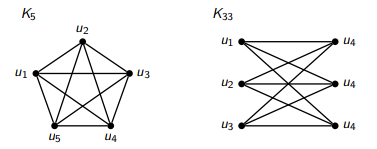
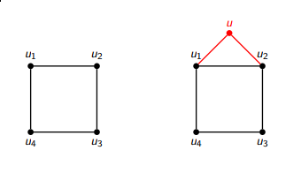
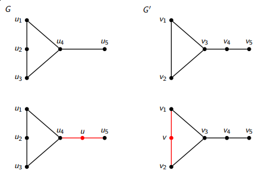

Grafos Planares
===============

Planaridad
----------

* Una representación planar de un grafo `G` es un conjunto de puntos en el plano que se corresponden con los nodos de `G` unidos por curvas que se corresponden con las aristas de `G`, sin que estas se crucen entre sí.

* Un grafo es planar si admite una representación planar.

* Dada una representación planar de un grafo `G`, una región es el conjunto de todos los puntos alcanzables desde un punto (que no sea un nodo ni una parte de una arista) sin atravesar nodos ni aristas.

* Todo representación planar de un grafo tiene exactamente una región de área infinita, la región exterior.

* La frontera de una región es el circuito que rodea a la región (puede tener nodos y aristas repetidos).

* El grado o tamaño de la región es el número de aristas que tiene su frontera.

* **Propiedad**: `K₅` y `K₃₃` son grafos no planares. `K₅` es el grafo no planar con el menor número de nodos y `K₃₃` es el que tiene el menor número de aristas.
    
    

* **Propiedad**: Si un grafo contiene un subgrafo no-planar es no-planar.

Subdivisión y homeomorfismo
---------------------------

* Subdividir una arista `e = (v,w)` de un grafo `G`, consiste en agregar `u ∉ V` un nodo a `G` y reemplazar la arista `e` por dos aristas `e' = (v,u)` y `e'' = (u,w)`.

    

* Un grafo `G'` es una subdivisión de otro grafo `G` si `G'` se puede obtener de `G` por sucesivas operaciones de subdivisión.

* Dos grafos `G` y `G'` se dicen homeomorfos si hay un isomorfismo entre una subdivisión de `G` y una de `G'`.
    
    

* **Propiedad**: Si `G'` es una subdivisión `G`, entonces `G` es planar si y sólo si `G'` es planar.

* **Propiedad**: La planaridad es invariante bajo homeomorfismo.

* **Corolario**: Si un grafo `G` tiene un subgrafo que es homeomorfo a un grafo no planar entonces `G` es no-planar.

Contracción
-----------

* La operación de contracción de una arista `e = (v,w)` consisteen eliminar la arista del grafo y considerar sus extremos como un solo nodo `u ∉ V`, quedando como aristas incidentes a `u` todos las aristas que eran incidentes a `v` o a `w`.

* Un grafo `G'` es una contracción de otro grafo `G` si se puede obtener a partir de `G` por sucesivas operaciones de contracción. En este caso se dice que `G` es contraible a `G'`.

Algoritmo de Demoucron, Malgrange y Pertuiset
---------------------------------------------

```
R := una representaci´on planar de cualquier ciclo de G

mientras R no sea una representaci´on planar de G hacer
    para cada parte p de G relativa a R calcular F(p)
        si para alg´un p, F(p) es vac´ıo entonces
            retornar FALSO
        si para alg´un p, F(p) = {f } entonces
            elegir p y f
        sino
            elegir cualquier p y f ∈ F(p)
            buscar camino q en p entre dos nodos de contacto de p
            R := R ∪ q
        fin si
    fin para
fin mientras

retornar VERDADERO y R representación planar de G
```

Teoremas sobre Planaridad
=========================

Teorema de Kuratowski (1930)
----------------------------
* **Teorema**: Un grafo es planar si y sólo si no contiene ningún subgrafo homeomorfo a `K₃₃` o `K₅`.

Teorema de Wagner (1937)
------------------------
* **Teorema**: `G` es planar si y sólo si no contiene ningún subgrafo contraíble a `K₃₃` o `K₅`.

* Preguntas frecuentes:
    * ¿Se podrían usar estos dos teoremas en la práctica para decidir si un grafo es planar?

Teorema de Euler (1752)
-----------------------
* **Teorema**: Si `G` es un grafo conexo planar entonces cualquier representación planar de `G` determina `r = m − n + 2` regiones en el plano (ecuación poliedral de Euler).

* **Corolario**: Si `G` es conexo y planar con `n ≥ 3`, entonces `m ≤ 3n − 6`.

* **Corolario**: `K₅` es no planar.

* **Corolario**: Si `G` es conexo, bipartito y planar con `n ≥ 3`, entonces `m ≤ 2n − 4`.

* **Corolario**: `K₃₃` es no planar.

Testeo de Planaridad (Demoucron)
--------------------------------

* **Lema**: Si `G` es planar, la representación planar `R` de cada iteración del ciclo del algoritmo es extensible a una representación planar de `G`.

* **Teorema**: El algoritmo de Demoucron es correcto, es decir encuentra una representación planar de `G` si existe, o si `G` es no planar lo reconoce correctamente.

* **Complejidad**: La complejidad de este algoritmo es `O(n²)`.
    * Existen algoritmos para detectar planaridad de complejidad menor. Hopcroft y Tarjan propusieron un algoritmo de complejidad `O(n)`, más complicado de describir que este.