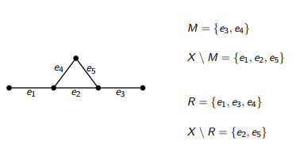

Matching - Conjunto Independiente - Recubrimientos
==================================================

Dado un grafo `G = (V, X)`

* Un **matching o correspondencia** entre los nodos de `G` es un conjunto `M ⊆ X` de aristas de `G` tal que para todo `v∈V`, `v` es incidente a lo sumo a una arista `e∈M`.

* Un **conjunto independiente** de nodos de `G` es un conjunto de nodos `I∈V` tal que para toda arista `e∈X`, `e` es incidente a lo sumo a un nodo `v∈I`.

* Un **recubrimiento de las aristas** de `G` es un conjunto `Rₙ` de nodos tal que para todo `e∈X`, `e` es incidente al menos a un nodo `v∈Rₙ`.

* Un **recubrimiento de los nodos** de `G`, es un conjunto `Rₑ` de aristas tal que para todo `v∈V`, `v` es incidente al menos a una arista `e∈Rₑ` .

* **Lema**: `S⊆V` es un conjunto independiente ⇐⇒ `V\S` es un recubrimiento de aristas.

* **Observación**: Esta relación no se mantiene entre matchings y recubrimientos de vértices, como lo muestra este ejemplo:
    
    

Matching máximo
---------------
* Un nodo `v` se dice saturado por un matching `M` si hay una arista de `M` incidente a `v`.

* Dado un matching `M` en `G`, un camino alternado en `G` con respecto a `M`, es un camino simple donde se alternan aristas que están en `M` con aristas que no están en `M`.

* Dado un matching `M` en `G`, un camino de aumento en `G` con respecto a `M`, es un camino alternado entre nodos no saturados por `M`.

* **Lema**: Sean `M₀` y `M₁` dos matching en `G` y sea `G'=(V,X')` con `X' = (M₀−M₁) ∪ (M₁−M₀)`. Entonces las componentes conexas de `G'` son de alguno de los siguientes tipos:
    * nodo aislado
    * circuito simple con aristas alternadamente en `M₀` y `M₁`
    * camino simple con aristas alternadamente en `M₀` y `M₁`

* **Teorema**: `M` es un matching máximo de `G` si y sólo si no existe un camino de aumento en `G` con respecto a `M`.

* **Teorema**: Dado un grafo `G` sin nodos aislados, si `M` es un matching máximo de `G` y `Rₑ` un recubrimiento mínimo de los nodos de `G`, entonces `|M|+|Rₑ| = n`.

* **Teorema**: Dado un grafo `G`, si `I` es un conjunto independiente máximo de `G` y `Rₙ` un recubrimiento mínimo de las aristas de `G`, entonces `|I|+|Rn| = n`.