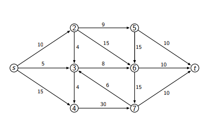
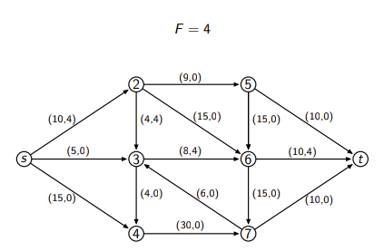
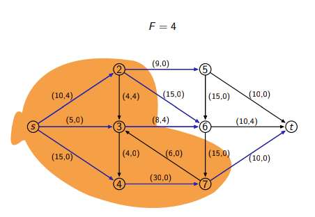
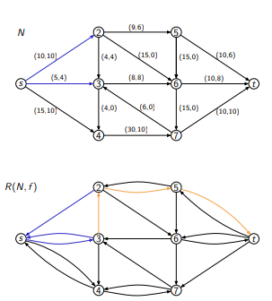
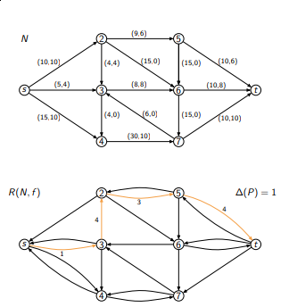
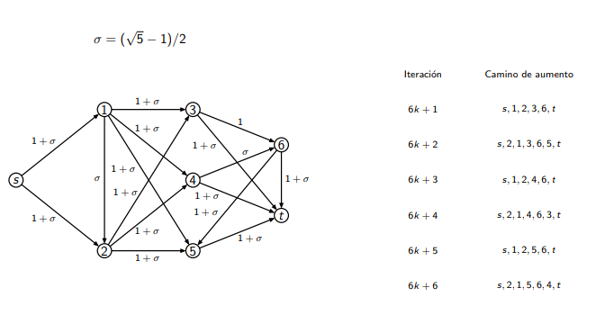

Flujo en Redes
==============

Definiciones
------------

* Una red `N=(V,X)` es un grafo orientado conexo que tiene dos nodos distinguidos una fuente `s`, con grado de salida positivo y un sumidero `t`, con grado de entrada positivo.

* Una **función de capacidades** en la red es una función `c : X → R≥0`.

	

* Un **flujo factible** en una red `N=(V,X)` con función de capacidad `c`, es una función `f:X→R≥0` que verifica:
	1. `0 ≤ f (e) ≤ c(e)` para todo arco `e ∈ X`.
	2. Ley de conservación de flujo:
		`sum{e∈In(v)}f(e)= sum{e∈Out(v)}f(e)`
		para todo nodo `v ∈ V \ {s,t}`, donde
		`In(v) = {e ∈ X, e = (w → v), w ∈ V}`
		`Out(v) = {e ∈ X, e = (v → w), w ∈ V}`

* El **valor del flujo** es `F = sum{e∈In(t)} f(e) − sum{e∈Out(t)} f(e)`.

	

Flujo Máximo
------------

* **Problema**: Determinar el flujo de valor máximo `F` que se puede definir en una red `N=(V,X)`.

* Un **corte** en la red `N=(V,X)` es un subconjunto `S ⊆ V \ {t}`, tal que `s ∈ S`.

* Dados `S, T ⊆ V`, `ST = {(u → v) ∈ X : u ∈ S y v ∈ T}`

* **Proposición**: Sea `f` un flujo definido en una red `N=(V,X)` y sea `S` un corte, entonces `F=sum{e∈SSᶜ}f(e) − sum{e∈SᶜS}f(e)`, donde `Sᶜ=V\S`.
	
	

* **Definición**: La capacidad de un corte `S` se define como `c(S) = sum{e∈SSᶜ} c(e)`.

* **Lema**: Si `f` es una función de flujo con valor `F` y `S` es un corte en `N`, entonces
`F ≤ c(S)`.

* **Corolario (certificado de optimalidad)**: Si `F` es el valor de un flujo `f` y `S` un corte en `N` tal que `F = c(S)` entonces `f` define un flujo máximo y `S` un corte de capacidad mínima.

Camino de Aumento
-----------------
* **Definición**: Dada una red `N=(V,X)` con función de capacidad `c` y un flujo factible `f` definimos la red residual, `R(N, f) = (V, Xᵣ)` donde `∀(v → w) ∈ X`,
	* `(v → w) ∈ Xᵣ` 	si `f((v → w)) < c((v → w))`.
	* `(w → v) ∈ Xᵣ` 	si `f((v → w)) > 0`.

* **Definición**: Dada una red `N=(V,X)` con función de capacidad `c` y un flujo factible `f`, un camino de aumento es un camino orientado `P` de `s` a `t` en `R(N, f)`.

	

* **Definición**: Dada una red `N=(V,X)` con función de capacidad `c` y un flujo factible `f`, para cada arco `(v→w)` en el camino de aumento `P`, definimos `∆((v → w)) =`... 
	* `c((v → w)) − f ((v → w))` 	si `(v → w)∈X`
	* `f((w → v))` 					si `(w → v)∈X`

* **Definición**: Dada una red `N=(V,X)` con función de capacidad `c` y un flujo factible `f`, `∆(P) = mín{e∈P} ∆(e)`

	

```
Entrada: Dada una red N con función de flujo f, la red residual R(N,f)=(V,Xᵣ).

S := {s}

mientras t∉S y ∃(v→w)∈Xᵣ y v∈S y w∉S hacer
	ant(w) := v
	S := S ∪ {w}
fin mientras

si t∉S entonces
	retornar S corte de V
si no
	reconstruir P entre s y t usando ant a partir de t
	retornar P camino de aumento
fin si
```

* **Proposición**: El algoritmo de camino de aumento determina un camino de aumento si existe, y si no llega a incorporar a `t` en `S` es porque no hay camino de aumento.
	* El algoritmo de camino de aumento no dice en que orden deben incorporarse los nodos a **S**.

* **Proposición**: Sea `f` un flujo definido sobre una red `N` con valor `F`
y sea `P` un camino de aumento en `R(N, f)`. Entonces el flujo `f'`, definido por `f'((v→w))=...`
	* `f((v → w))` 			si `(v→w)∉P`
	* `f((v → w))+∆(P)` 		si `(v→w)∈P`
	* `f((v → w))−∆(P)` 		si `(w→v)∈P`
	es un flujo factible sobre `N` con valor `F'=F+∆(P)`.

* **Teorema**: Sea `f` un flujo definido sobre una red `N`. Entonces `f` es un flujo máximo ⇐⇒ no existe camino de aumento en `R(N,f)`.

* **Teorema**: Dada una red `N`, el valor del flujo máximo es igual a la capacidad del corte mínimo.

Algoritmo de Ford y Fulkerson
-----------------------------

```
Entrada: Red N = (X, V) con función de capacidad c: X → R⁺.

definir un flujo inicial en N
	(por ejemplo f(e) := 0 para todo e ∈ X)

mientras exista P := camino de aumento en R(N, f) hacer
	para cada arco (v→w) de P hacer
		si (v→w)∈X entonces
			f((v→w)) := f((v→w))+∆(P)
		si no ((w→v)∈X)
			f((w→v)) := f((w→v))−∆(P)
		fin si
	fin para
fin mientras
```

* **Teorema**: Si las capacidades de los arcos de la red son enteras el problema de flujo máximo tiene un flujo máximo entero.

* **Teorema**: Si los valores del flujo inicial y las capacidades de los arcos de la red son enteras el método de Ford y Fulkerson realiza a lo sumo `n*U` iteraciones, siendo entonces `O(n*m*U)`, donde `U` es una cota superior finita para el valor de las capacidades.

	Si las capacidades o el flujo inicial son números irracionales, el método de Ford y Fulkerson puede no parar (realizar un número infinito de pasos).

	Si no se especifica el orden en el que se eligen los arcos y nodos a marcar en el algoritmo de camino de aumento, el número de iteraciones puede ser no polinomial respecto del tamaño del problema.

	

* Usa BFS en el algoritmo de camino de aumento para marcar nodos.

* La complejidad del algoritmo es `O(m*2*n)`.

* Hay otros algoritmos más eficientes (más complicados).