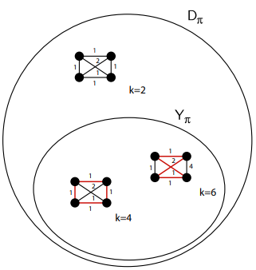
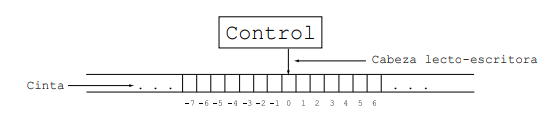
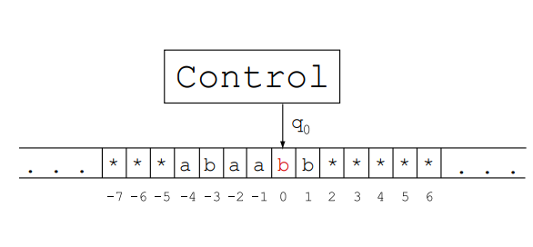
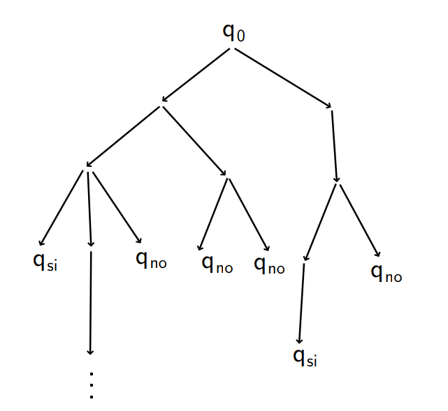

Complejidad - Problemas NP-completos
====================================

Teoría de Complejidad
---------------------
* Un algoritmo eficiente es un algoritmo de complejidad polinomial.
* Un problema está bien resuelto si se conocen algoritmos eficientes para resolverlo.
* El objetivo es clasificar los problemas según su complejidad.
* Un problema de decisión es un problema cuya respuesta es SI o NO.
* La clasificación y estudio de teoría de complejidad se aplica a problemas de decisión.

Instancia de un problema Π
--------------------------
* Una instancia de un problema es una especificación de sus parámetros.
* Un problema de decisión `Π` tiene asociado un conjunto `DΠ` de instancias, y un subconjunto `YΠ ⊆ DΠ` de instancias cuya respuesta es SI.

Ejemplo: TSP
------------
* Dado un grafo completo con peso en las aristas y un número k, ¿existe un circuito Hamiltoniano de longitud a lo sumo k?

    

Distintas versiones de un problema de optimización Π
----------------------------------------------------
Dada una instancia `I` del problema `Π`:

* Versión de evaluación: Determinar el valor de una solución óptima de `Π` para `I`.
* Versión de optimización: Encontrar una solución óptima del problema `Π` para `I` (de valor mínimo o máximo).
* Versión de decisión: Dado un número `k`, ¿existe una solución factible de `Π` para `I` tal que `c(S)≤k` si el problema es de minimización (o `c(S)≥k` si el problema es de maximización)?
* Versión de localización: Dado un número `k`, determinar una solución factible de `Π` para `I` tal que `c(S)≤k`.

Ejemplo: Problema del viajante de comercio
------------------------------------------
Dado un grafo G con longitudes asignadas a sus aristas:

* Versión de evaluación: Determinar el valor de una solución óptima, o sea la longitud de un circuito hamiltoniano de `G` de longitud mínima.
* Versión de optimización: Determinar un circuito hamiltoniano de `G` de longitud mínima.
* Versión de decisión: Dado un número `k`, ¿existe un circuito hamiltoniano de `G` de longitud menor o igual a `k`?
* Versión de localización: Dado un número `k`, determinar un circuito hamiltoniano de `G` de longitud menor o igual a `k`.

Distintas versiones de un problema de optimización Π
----------------------------------------------------
¿Qué relación hay en la dificultad de resolver las distintas versiones de un mismo problema? Si resolvemos el problema de decisión, podemos:

* Resolver el problema de evaluación usando búsqueda binaria sobre el parámetro `k`.
* Resolver el problema de localización resolviendo el problema de decisión para el parámetro `k` para una versión reducida de la instancia.
* Resolver el problema de optimización resolviendo el problema de decisión para el valor óptimo para una versión reducida de la instancia.

Problemas intratables
---------------------
Un problema es intratable si no puede ser resuelto por algún algoritmo eficiente. Un problema puede ser intratable por distintos motivos:

* El problema requiere una repuesta de longitud exponencial (ejemplo: pedir todos los circuitos hamiltonianos de longitud a lo sumo `k`).
* El problema es indecidible (ejemplo: problema de la parada).
* El problema es decidible pero no se conocen algoritmos polinomiales que lo resuelvan (no se sabe si es intratable o no).

Modelos de Computadoras
-----------------------
Modelos formales para expresar cualquier algoritmo:

* Máquina de Turing (1937, Alan Turing)
* Máquinas de Acceso Random - RAM (1974, Aho, Hopcroft y Ullman).

Los dos modelos son polinomialmente equivalente. Es decir, se puede simular uno a otro con un costo polinomial.

Máquina de Turing Determinística
--------------------------------
* Consiste de un conjunto finito de estados, una cabeza lecto-escritora y una cinta infinita en ambas direcciones con el siguiente esquema.
    * `Σ` finito, el alfabeto
    * `Γ` = `Σ∪{∗}`
    * `Q` finito, el conjunto de estados
    * `q_0 ∈ Q`, estado inicial
    * `Q_f ⊆ Q`, estados finales (`q_si` y `q_no` para problemas de decisión)

    


* Sobre la cinta está escrito la entrada, que es un string de símbolos de `Σ` y el resto de las celdas tiene `∗` (blancos).
* Se define un programa `S` como un conjunto de quíntuplas `S⊆Q×Γ×Q×Γ×M`, donde `M={+1,−1}` son los movimientos de la cabeza a derecha o izquierda (tabla finita de instrucciones).
* Para todo par `(qᵢ,sⱼ)`, existe a lo sumo una quíntupla que comienza con ese par (máquina determinística).

* Arranque:
    * máquina posicionada en el estado distinguido `q0`, estado inicial
    * cabeza lecto-escritora ubicada en la celda inicial `(0)` de la cinta
* Terminación:
    * cuando no se puede inferir nuevas acciones para seguir
    * cuando se alcanza un estado final (si el estado final es de SI, entonces la respuesta es SI, caso contrario la respuesta es NO).

* La quíntupla `(qᵢ,sₕ,qⱼ,sₖ,+1)` se interpreta como: si la máquina está en el estado qᵢ y la cabeza lee sₕ, entonces escribe sₖ, se mueve a la derecha y pasa al estado qⱼ.

* Ejemplo:
    * `Σ = {a, b}`;
        `Γ = Σ ∪ {∗}`;
    * `Q = {q₀, q₁, q_si, q_no}`;
        `Qf = {q_si, q_no}`
    * `S = (q₀, a, q₀, a, +1)`,
        `(q₀, b, q₁, a, −1)`,
        `(q₀, ∗, q_si, ∗, −1)`,
        `(q₁, a, q₀, a, −1)`,
        `(q₁, b, q_no , a, −1)`,
        `(q₁, ∗, q₀, b, +1)`

    

* Una máquina `M` resuelve el problema `Π` si para toda instancia alcanza un estado final y responde de forma correcta (o sea, termina en un estado final correcto).

* La complejidad de una MTD está dada por la cantidad de movimientos de la cabeza, desde el estado inicial hasta alcanzar un estado final, en función del tamaño de la entrada.
    `Tₘ(n) = máx{m tal que x∈DΠ, |x|=n y M con entrada x hace m movimientos}`

* Existen otros modelos de computadoras determinísticas (máquina de Turing con varias cintas, Random Access Machines, etc.) pero puede probarse que son equivalentes en términos de la polinomialidad de los problemas a la MTD.

La clase P
----------
Un problema Π está en P si:

* Existe una MTD de complejidad polinomial que lo resuelve.
    `P = {Π tq ∃M MTD, M resuelve Π y TM(n) ∈ O(p(n)) para algún polinomio p}`

Que es equivalente a:

* Existe un algoritmo polinomial que lo resuelve. 

Máquinas de Turing No Determinísticas (MTND)
--------------------------------------------
* No se pide unicidad de la quíntupla que comienza con cualquier par `(qᵢ,sⱼ)`.

* Un programa correspondiente en una MTND es una tabla que mapea un par `(qᵢ,tᵢ)` a un conjunto de ternas `(q_f,t_f,{+1, −1})`.

* Esto admite dos interpretaciones equivalentes:
    * En cada paso se selecciona una de las alternativas posibles.
    * En cada paso se continúa la ejecución en paralelo de las distintas alternativas, generando una copia de la MTND por cada alternativa.

* Una MTND resuelve un problema de decisión `Π` si:
    * existe una secuencia de alternativas que lleva a un estado de aceptación si y sólo si la respuesta es SI, o bien
    * alguna de las copias se detiene en un estado de aceptación si y sólo si la respuesta es SI.

* Es equivalente a: Para toda instancia de `YΠ` existe una rama que llega a un estado final `qsi` y para toda instancia en `DΠ \ YΠ` ninguna rama llega a un estado final `qsi`.

* La complejidad temporal de una MTND se define como el máximo número de pasos que toma como mínimo reconocer una instancia de `YΠ` (instancia con respuesta SI) en función de su tamaño.

    

* Una MTND es polinomial para `Π` cuando existe una función polinomial `T(n)` de manera que para toda instancia de `YΠ` de tamaño `n`, alguna de las ramas termina en estado `qsi` en a lo sumo `T(n)` pasos.

La clase NP
-----------
Un problema `Π∈NP` (polinimial no-determinístico) si:
* Las instancias de `Π` con respuesta SI son reconocidas por una MTND polinomial.

Equivalentemente:
* Dada una instancia de `Π` con respuesta SI se puede dar un certificado que garantiza que la respuesta es SI, y esta garantía puede ser verificada en tiempo polinomial.
* La clase NP se puede definir como el conjunto de problemas de decisión que se pueden resolver por un algoritmo polinomial no-determinístico.

* **Lema**: Si `Π` es un problema de decisión que pertence a la clase NP, entonces `Π` puede ser resuelto por un algoritmo determinístico en tiempo exponencial respecto del tamaño de la entrada.

Ejemplo: Conjunto independiente máximo
--------------------------------------
Dado un grafo `G = (V, X)` y un entero `k`, ¿tiene `G` un conjunto independiente de tamaño mayor o igual a `k`?
* `guess(S)`: función multivaluada que retorna un nuevo elemento de `S`.

```
I := ∅

mientras S 6= ∅ hacer
    v := guess(S)
    S := S \ {v}

    si Γ(v) ∩ I = ∅ entonces
        I := I ∪ {v}
    fin si

    si |I| ≥ k entonces
        retornar SI
    fin si
fin mientras

retornar NO
```

O equivalentemente:

* Certificado `S ⊆ V`: conjunto de vértices
    * verificar que `|S| ≥ k`
    * verificar que `S` es conjunto independiente

* Es posible verificar en tiempo polinomial que `S` garantiza que la instancia tiene respuesta SI.

Las clases P y NP
-----------------
* `P ⊆ NP`.
* **Problema abierto: ¿Es P = NP?**
    * Todavía no se demostró que exista un problema en NP\P.
    * Mientras tanto, se estudian clases de complejidad “relativa”, es decir, que establecen orden de dificultad entre problemas.

Ejemplos de problemas en NP
---------------------------
* Suma de enteros.
* Multipliación de enteros.
* Arbol generador mínimo.
* Clique máxima.
* Camino mínimo entre un par de nodos.
* Problema del viajante de comercio.
* Conjunto independiente de cardinal máximo.
* Problema de satisfabilidad (SAT): Dado un conjunto de claúsulas `C₁,...,Cₘ` formadas por literales basados en las variables booleanas `X={x₁,...,xₙ}`, determinar si hay una asignación de valores de verdad a las variables de `X` tal que la expresión `C₁∧C₂∧...∧Cₘ` sea verdadera.

Transformaciones polinomiales
-----------------------------
* Una **transformación o reducción polinomial** de un problema de decisión `Π₁` a uno `Π₂` es una función polinomial `f : DΠ₁ → DΠ₂` que transforma una instancia de `I₁` de `Π₁` en una instancia `f(I₁)=I₂` de `Π₂` tal que `I₁∈YΠ₁ ⇔ I₂∈YΠ₂`.

* El problema de decisión `Π₁` se reduce polinomialmente a otro problema de decisión `Π₂`, `Π₁≤ₚΠ₂`, si existe una transformación polinomial de `Π₁` a `Π₂`.

* Las reducciones polinomiales son transitivas: si `Π₁≤ₚΠ₂` y `Π₂≤ₚΠ₃` entonces `Π₁≤ₚΠ₃`.

La clase NP-completo
--------------------
Un problema de decisión Π es **NP-completo** si:
1. **Π∈NP**
2. **∀Π'∈NP, Π'≤ₚΠ**
Si un problema `Π` verifica la condición 2, `Π` es **NP-difícil** (es al menos tan “difícil” como todos los problemas de NP).

* El problema SAT consiste en decidir si, dada una fórmula lógica `ϕ` expresada como conjunción de disyunciones (ej: `ϕ=x₁∧(x₂∨¬x₁)∧(x₃∨¬x₄∨x₁))`, existe una valuación de sus variables que haga verdadera `ϕ`.
* **Teorema (Cook, 1971 - Levin, 1973)**: SAT es NP-completo.
    
    La demostración de Cook es directa: considera un problema genérico `π∈NP` y una instancia genérica `d∈Dπ`. A partir de la hipotética NDTM que resuelve `π`, genera en tiempo polinomial una fórmula lógica `ϕπ,d` en forma normal (conjunción de disyunciones) tal que `d∈Yπ` si y sólo si `ϕπ,d` es satisfactible.

¿Cómo se prueba que un problema es NP-completo?
-----------------------------------------------
* Usando la transitividad de las reducciones polinomiales, a partir de este primer resultado podemos probar que otros problemas son NP-completos.
* Si `Π` es un problema de decisión, podemos probar que `Π` ∈ NP-completo encontrando otro problema `Π₁` que ya sabemos que es NP-completo y demostrando que:
    1. `Π ∈ NP`
    2. `Π₁ ≤ₚ Π`
    
    La segunda condición en la definición de problema NP-completo se deriva de la transitividad:
Sea `Π'` un problema cualquiera de NP. Como `Π₁` es NP-completo, `Π' ≤ₚ Π₁`. Como probamos que `Π₁ ≤ₚ Π`, resulta `Π' ≤ₚ Π`.

La clase NP-completo
--------------------
* Desde 1971, se ha probado la NP-completitud de muchos problemas usando el método anterior.
* A partir del Teorema de Cook-Levin, Richard Karp demostró en 1972 que otros 21 problemas son NP-completos.
* Actualmente se conocen más de 3.000 problemas NP-completos

Problemas NP-completos
----------------------
* CLIQUE (dado un grafo `G` y un entero positivo `k`, ¿`G` tiene una clique de tamaño mayor o igual a `k`?).
* Conjunto independiente (dado un grafo `G` y un entero positivo `k`, ¿`G` tiene un conjunto independiente de tamaño mayor o igual a `k`?).
* Recubrimiento de aristas (dado un grafo `G` y un entero positivo `k`, ¿`G` tiene un recubrimiento de aristas de tamaño menor o igual a `k`?)

Reducción de SAT a 3-SAT
------------------------
* El problema 3-SAT es una variante del problema SAT, en el cual cada cláusula tiene exactamente tres literales. Como es una restricción del dominio de SAT, está en NP, y en principio es “no más difícil” que SAT.
* Para probar que 3-SAT es NP-completo, vamos entonces a reducir SAT a 3-SAT.

* Tomemos una instancia genérica de SAT `ϕ = C₁∧...∧Cₘ`.

* Vamos a reemplazar cada `Cᵢ` por una conjunción de disyunciones `ϕ'ᵢ`, donde cada disyunción tenga tres literales, y de manera que `ϕ` sea satisfactible si y sólo si `ϕ'₁∧...∧ϕ'ₘ` lo es.

* Si `Cᵢ` tiene tres literales:
    * `ϕ'ᵢ = Cᵢ`

* `Cᵢ` tiene dos literales, `x₁` y `x₂`, agregamos una variable nueva y y definimos: 
    * `Cᵢ = (x₁ ∨ x₂) → ϕ'ᵢ = (x₁ ∨ x₂ ∨ y) ∧ (x₁ ∨ x₂ ∨ ¬y)`.

* Si `Cᵢ` tiene `k≥4` literales, agregamos `k−3` variables nuevas:
    * `Cᵢ = (x₁ ∨ x₂ ∨ ... ∨ xᵣ ∨ ... ∨ xₖ₋₁ ∨ xₖ) →`
        `ϕ'ᵢ = (x₁ ∨ x₂ ∨ y₁)∧...∧(¬yᵣ₋₂ ∨ xᵣ ∨ yᵣ₋₁)∧...∧(¬yₖ₋₃ ∨ xₖ₋₁ ∨ xₖ)`

* Ej: `Cᵢ = (x₁ ∨ x₂ ∨ x₃ ∨ x₄ ∨ x₅) → ϕ'ᵢ = (x₁ ∨ x₂ ∨ y₁)∧(¬y₁ ∨ x₃ ∨ y₂)∧(¬y₂ ∨ x₄ ∨ x₅)`

Coloreo es NP-completo
----------------------
Probar que coloreo es NP.

Para probar que coloreo es NP-completo, vamos entonces a reducir SAT a coloreo.

Reducción de SAT a coloreo
--------------------------

* Tomemos una instancia genérica de SAT `ϕ = C₁∧...∧Cₘ`.
* Vamos a construir un grafo `G` y determinar un número `k` de manera que `ϕ` sea satisfactible si y sólo si `G` se puede colorear con `k-colores`.
    
    

* `G` tiene:
    * `V₁`: un vértice por cada variable negada y afirmada, todos adyacentes entre si.
    * `V₂`: un vértice por cada cláusula, adyacente a los literales de V₁ que no aparecen en la cláusula.
    * `V₃`: otro vértice por cada variable, adyacente a todo `V₂` y a los literales de `V₁` correspondientes a otras variables.
* `k` = dos veces la cantidad de variables.

Conjunto independiente es NP-completo
-------------------------------------
Probar que conjunto independiente es NP.

Para probar que conjunto independiente es NP-completo, vamos a reducir 3-SAT a conjunto independiente.

* Tomemos una instancia genérica de 3-SAT `ϕ = C₁∧...∧Cₘ`, con `Cⱼ` la disyunción de 3 literales. 
* Vamos a construir un grafo `G` y determinar un número `k` de manera que `ϕ` sea satisfactible si y sólo si `G` tiene un conjunto independiente de tamaño mayor o igual a `k`.

Reducción de 3-SAT a conjunto independiente
-------------------------------------------
* Si el literal `xᵢ` figura en la clausula `Cⱼ` agregamos el nodo `vᵢⱼ`.
* Si el literal `¬xᵢ` figura en la clausula `Cⱼ` agregamos el nodo `v¬ᵢⱼ`.
* Agregamos una arista entre todos los nodos provenientes de la misma clausula (formando un `K₃` para cada clausula).
* Agregamos aristas entre nodos representando a un literal y su negación.
* Definimos `k = m`.

¿¿P ≠ NP??
----------
* Si existe un problema en `NP-c ∩ P`, entonces `P=NP`.
    * Si `Π ∈ NP-c ∩ P`, existe un algoritmo polinomial que resuelve `Π`, por estar `Π` en P. Por otro lado, como `Π` es NP-completo, para todo `Π' ∈ NP, Π' ≤ₚ Π`.
    * Sea `Π' ∈ NP`. Aplicando la reducción polinomial que transforma instancias de `Π'` en instancias de `Π` y luego el algoritmo polinomial que resuelve `Π`, por definición de reducción polinomial, se obtiene es un algoritmo polinomial que resuelve `Π'`.

* Hasta el momento no se conoce ningún problema en `NP-c ∩ P`.

* Tampoco se ha demostrado que un problema esté en NP\P.
    * En ese caso se probaría que P ≠ NP.

La clase Co-NP
--------------
* Un problema de decisión pertenece a la **clase Co-NP** si dada una instancia de NO y evidencia de la misma, puede ser verificada en tiempo polinomial.

* El **problema complemento** de un problema de decisión `Π`, `Πᶜ`, es el problema de decisión que responde al complemento de la decisión de `Π`.
    * Ejemplo: problema de primalidad y problema de número compuesto.

* El problema `Πᶜ` tiene respuesta NO si y sólo si `Π` tiene respuesta SI.

* La clase CO-NP es la clase de los problemas complemento de los problemas de la clase NP.

* La clase de los problemas polinomiales (P), está contenida también en Co-NP.

Problemas abiertos de Teoría de Complejidad
-------------------------------------------
Con estas nuevas definiciones tenemos los siguientes problemas abiertos:

* ¿Es P = NP?
* ¿Es Co-NP = NP?
* ¿Es P = Co-NP ∩ NP?

    

    

Extensión de un problema
------------------------
El problema `Π` es una **restricción** de un problema `Π'` si el dominio de `Π` está incluído en el de `Π'`.
* Se dice que `Π'` es una extensión de `Π`.

* Si `Π` ∈ NP-completo, entonces `Π'` ∈ NP-difícil.

* Ejemplos:
    * Viajante de comercio es una extensión de Circuito Hamiltoniano.
    * 3-SAT es una restricción de SAT. Sabiendo que SAT es NP-completo, ¿podemos sacar de esto una conclusión sobre la complejidad de 3-SAT?

Algoritmos Pseudopolinomiales
-----------------------------
Un algoritmo para resolver un problema `Π` es pseudopolinomial si la complejidad del mismo es polinomial en función del valor (¡no del tamaño!) de la entrada.

* **Ejemplo**: El problema de la mochila es NP-Completo, sin embargo, existe un algoritmo de complejidad `O(nB)` que lo resuelve, donde `n` es la cantidad de objetos y `B` el peso máximo que se puede cargar en la mochila.

Teoría de Complejidad
---------------------
Preguntas importantes:

* ¿Qué hacer ante un problema del que no sabemos en que clase está?
* ¿Qué importancia tiene saber si un problema está en P o no, desde el punto de vista teórico?
* ¿Qué importancia tiene la misma pregunta desde el punto de vista práctico, o sea ante una aplicación real que se quiere resolver?
* ¿Qué hacemos si el problema que tenemos en la práctica sabemos que es NP-completo?